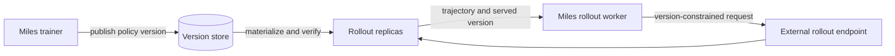

Disaggregated RL rollout separates policy training from the inference resources
that generate trajectories. In the standard miles topology, the trainer and
SGLang engines use different GPUs inside one miles job. A stronger separation
puts rollout behind an external service that owns its replicas, routing, and
weight activation.

Both forms solve the same placement problem, but the external-service boundary
adds a policy-version problem: miles must publish new policies without owning
each rollout engine, and every trajectory must still identify the policy that
generated it.

This page is about separating **RL training from rollout inference**. It is
different from [PD disaggregation](/advanced/pd-disaggregation), which separates
the prefill and decode phases inside an SGLang deployment.

## Topologies

| Topology | Who starts the engines? | What miles talks to | Weight-update ownership | Availability |
|---|---|---|---|---|
| Miles-managed rollout | miles | A miles-managed router and engine handles | miles converts, transfers, pauses, updates, and resumes the engines | Current `main` |
| Attached SGLang engines | The deployment owner | Fixed engine addresses supplied with `--rollout-external-engine-addrs` | miles still addresses and controls each engine through its engine handle | Current `main` |
| External rollout service | An independent rollout system | One rollout endpoint | miles publishes policy versions; the rollout system materializes and activates them | Miles-side integration is being upstreamed |

`--rollout-external` is the second row, not the third. It prevents miles from
launching SGLang, but miles still knows the individual engine addresses, checks
their configuration, registers them with its router, and calls their
weight-update lifecycle.

An external rollout service is a narrower interface. Miles sends rollout
requests to one endpoint and publishes new policy versions without needing an
engine handle for every replica. The service behind that endpoint can be
implemented by any deployment or control-plane package that satisfies the
request and policy-version contracts below.

## Separate trainer and rollout GPUs

Disaggregated placement is the miles default. Give the trainer and rollout
engines separate GPU counts and do not pass `--colocate`:

```bash
--actor-num-nodes 1 \
--actor-num-gpus-per-node 8 \
--rollout-num-gpus 8 \
--rollout-num-gpus-per-engine 2
```

The trainer and engines remain resident on their own GPUs, so they can run at
the same time under `train_async.py`. In a colocated job the two roles share
GPUs and take turns; fully async rollout therefore requires the disaggregated
layout. See [Training Backends: Choosing the GPU layout](/user-guide/training-backend#3-choosing-the-gpu-layout)
for placement and offload behavior.

To attach SGLang engines launched outside the miles Ray job, provide their
addresses explicitly:

```bash
--rollout-external \
--rollout-external-engine-addrs 10.0.1.10:30000 10.0.1.11:30000
```

The engines must be reachable from the miles job and must have server settings
compatible with the rollout configuration. Because miles retains individual
engine handles, `--rollout-external` does not hand off weight-update ownership:
miles still runs the selected weight-update lifecycle.

## Weight synchronization

Once training and rollout use different GPUs, updated weights have to cross the
boundary between them. `--update-weight-transfer-mode` selects the current
Miles-managed path:

| Mode | Data path | Use when |
|---|---|---|
| `broadcast` | Gather and convert trainer weights, then broadcast them to the SGLang ranks over NCCL | Trainer and rollout ranks have NCCL connectivity; this is the default |
| `p2p` | Convert and re-shard weights, then write them directly to rollout-rank memory over RDMA | Large disaggregated jobs where direct rank-to-rank transfer is available; see [P2P Weight Transfer](/advanced/p2p-weight-transfer) |
| `disk-delta` | Publish changed canonical checkpoint bytes to shared storage, let rollout hosts materialize them locally, then reload | Trainer and rollout cannot share an NCCL fabric, or model-sized full-weight transfer dominates the update |

These are weight synchronization choices, not different rollout APIs. In the
first two modes, miles transfers tensors into engine runtime layouts directly.
Disk-delta instead establishes a versioned publication boundary that can also
be consumed by an external rollout system.

### Disk-delta publication and activation

Enable disk-delta on a non-colocated Megatron run with a publication directory
visible to the trainer and rollout hosts, plus a host-local checkpoint
directory for each rollout host:

```bash
--update-weight-transfer-mode disk-delta \
--update-weight-disk-dir /shared/miles/weight-updates \
--update-weight-local-checkpoint-dir /local-nvme/miles-rollout-checkpoint
```

The current lifecycle is:

1. On the first `update_weights()` call, miles captures a CPU snapshot from
   `--hf-checkpoint`. No delta version is published. Each rollout host also
   materializes the same base checkpoint in its local directory.
2. At the next update boundary, source trainer ranks gather Megatron tensors
   under their canonical Hugging Face names and compare their bytes with the
   previous snapshot.
3. Miles publishes `weight_vNNNNNN/` with compressed changed bytes and an index
   containing the version, base version, delta encoding, and final-state
   checksums. Files are written atomically before the version is consumed.
4. Each rollout host pulls the version and patches its host-local checkpoint.
   Delta application verifies the checksum of the resulting tensor, not only
   the transferred delta.
5. Miles pauses generation, reloads the materialized checkpoint into SGLang,
   advances the engine weight version, and resumes generation.

Pull and local materialization happen before the engine pause and can overlap
inference. Reloading the prepared weights is the activation boundary that
requires the pause.

The default delta encoding is XOR. It produces a compact byte-wise delta but
must be applied exactly once to the declared base version. `overwrite` stores
changed positions and their new values; it is larger but idempotent. Both
encodings are byte-oriented: the base and exported policy must agree on tensor
names, dtypes, shapes, and byte layout.

Each published tensor carries a checksum of its complete target state.
`xxh3-128` is the default; `blake3` and `adler32` are also accepted. A lineage,
layout, or checksum mismatch fails the update instead of activating a partially
updated policy.

On a POSIX shared filesystem, the published version becomes visible through
the normal filesystem contract. Object-store-backed mounts can use
`--custom-update-weight-post-write-path` on the miles side and
`--sglang-custom-pull-weights-pre-read-hook` on the SGLang side to make writes
visible before a rollout host reads them.

The maintained end-to-end coverage is
[`tests/e2e/megatron/test_qwen3_4B_disk_delta.py`](https://github.com/radixark/miles/blob/main/tests/e2e/megatron/test_qwen3_4B_disk_delta.py).
It exercises a Qwen3-4B Megatron trainer and two SGLang rollout engines on a
single 8-GPU node. The same storage contract supports separate hosts, but the
registered test does not reproduce a cross-cluster deployment.

Current `main` rejects disk-delta with `--colocate`, LoRA, or PD
disaggregation. It also requires `--hf-checkpoint` to be a local checkpoint
directory. The implementation is selected by the Megatron actor; it is not a
general FSDP weight-update path.

## External rollout service contract

Current `main` does not accept a single external rollout-service URL and cannot
publish disk deltas without Miles-managed rollout-engine handles. This section
records the interface being upstreamed; it is not a current launch recipe.

The intended boundary has two independent data paths:



Miles does not need to know how many replicas are behind the endpoint, where
they run, or how the service replaces them. The integration is defined by
ownership:

| Miles owns | The external rollout service owns |
|---|---|
| Training state and optimizer steps | Replica placement, scaling, and health |
| Conversion to canonical rollout-visible tensors | Materializing published versions on rollout hosts |
| Policy version numbering and publication | Verifying lineage and final-state checksums before activation |
| The policy-version requirement attached to each rollout request | Routing requests only to replicas that satisfy that requirement |
| Recording the served version on returned samples | Staging, admission control, activation, and reporting the version that served a request |

The rollout endpoint and the version store are separate interfaces. The
request path should not have to carry model-sized weights, and publishing a new
version should not require miles to enumerate the current replicas.

### Policy-version requirements

An external rollout request needs more than an inference payload. It must be
able to express the policy version the caller can accept:

- A **minimum version** permits any replica at or above the requested version.
  This bounds staleness while allowing the fleet to converge gradually.
- An **exact version** requires the replica to serve one particular policy.
  It is useful for reproducibility, evaluation, and update validation.

If no compatible replica is ready, the service returns a retryable response
instead of silently serving an older policy. Retrying a stateful generation is
safe only when the rollout integration defines an idempotency and session
contract; the generic miles request path should not assume that every failed
generation can be replayed.

The response reports which version served the request. For long or agentic
trajectories, recording both the version at generation start and at generation
end also exposes whether an activation occurred while the request was in
flight. Miles can then attach the observed version to the sample rather than
inferring it from the trainer's latest published version.

### Publication and replica convergence

A policy version becomes eligible for rollout only after its complete artifact
is visible. The publication contract therefore needs:

1. an immutable version identifier and its base lineage;
2. atomic visibility of the completed version;
3. final-state checksums for every changed tensor;
4. a way for a new or restarted replica to materialize a valid base and catch
   up through later versions; and
5. an activation acknowledgement before a replica advertises the new version.

Disk-delta already provides version and base identity, atomic file writes, and
final-state checksums. For an external consumer, the publication hook and
version store must also expose the completed version as one commit boundary.
Replica catch-up, admission, and activation belong to the external rollout
system. Other publication formats can implement the same boundary without
using disk-delta, as long as miles and the rollout system agree on version
identity and rollout-visible weights.

## Fully async rollout

Disaggregation and fully async rollout answer different questions:

- Disaggregation decides where training and rollout run and who owns the
  rollout engines.
- [Fully Async RL](/user-guide/fully-async) decides how generation, buffering,
  and optimizer steps overlap.

With Miles-managed engines, fully async rollout keeps generation in flight
while the trainer consumes completed groups and takes optimizer steps. At each
configured update boundary, the current schedule still synchronizes the active
generation call before invoking the weight updater. Disk-delta host
materialization occurs before the subsequent engine pause, but current `main`
does not overlap an opaque external publication with that active generation
call.

An external rollout service allows policy publication and replica preparation
to proceed without draining the entire fleet. Only activation needs a short
engine-local pause. Different replicas may converge at different times, so
request constraints and served-version attribution become part of the RL data
contract rather than optional serving metadata.

Miles already uses weight versions to measure fully async sample staleness. A
service integration must preserve that information so
`--max-weight-staleness` and custom data-buffer policies make decisions from
the policy that generated each sample.

## What to measure

End-to-end `update_weights` time is not enough for a disaggregated service. It
mixes phases with different effects on rollout availability:

| Measurement | What it isolates |
|---|---|
| Trainer encode and publish | Megatron-to-HF conversion, delta construction, compression, and publication |
| Publication size and changed-byte density | Storage and network demand per version |
| Replica materialization | Fetch, lineage verification, delta application, and runtime-layout preparation while serving |
| Activation pause | Time the engine cannot admit or advance generation while prepared weights become active |
| Version convergence | Time from completed publication until the required rollout capacity advertises the version |
| Request version lag | Difference between the requested, served, and newest published policy versions |

For current disk-delta runs, miles records
`perf/update_weights_density` and `perf/update_weights_wire_bytes` in addition
to the normal weight-update timing.

As one external reference, a fully async GLM-4.7-Flash deployment used 4 × 8
H200 trainer GPUs and 48 × 1 H200 rollout replicas. Across its recorded
steady-state samples, trainer XOR encode and publish averaged 15.0 seconds,
replica preparation while serving averaged 15.8 seconds, and activation paused
an engine for 0.75 seconds on average. The average changed-byte density was
0.252%, producing a 0.469 GB compressed delta. The complete path took roughly
30–35 seconds, but only activation paused inference.

Those measurements come from a
[Stitch reference deployment](https://github.com/modal-projects/stitch/blob/main/cookbook/README.md#weight-update-performance),
not from the registered miles E2E test. They illustrate why preparation and
activation should be reported separately; they are not a general performance
claim for miles, SGLang, or another rollout service.

## Related guides

- [Fully Async RL](/user-guide/fully-async)
- [Training Backends](/user-guide/training-backend)
- [P2P Weight Transfer](/advanced/p2p-weight-transfer)
- [PD Disaggregation](/advanced/pd-disaggregation)
