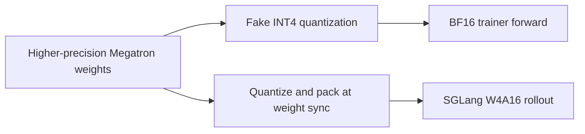

INT4 QAT in miles is a matched training-and-rollout path for Mixture-of-Experts
(MoE) models. SGLang serves routed expert projections with packed INT4 weights,
while Megatron fake-quantizes the same projections during each training forward
pass. The trainable weights, gradients, optimizer state, activations, and
trainer GEMMs remain in their configured higher precision.

Use this path to reduce rollout weight memory, accelerate supported rollout
GEMMs, and reduce the numerical drift caused by training an expert in BF16 but
serving it in INT4. It is not an INT4 optimizer or a general-purpose way to cut
trainer memory by 4x.

<Warning>
INT4 QAT is beta and model-specific. The current Megatron hook covers routed
expert weights implemented with Transformer Engine's grouped linear layer. It
does not fake-quantize attention, embeddings, shared experts, ordinary dense
MLPs, or the LM head. The checkpoint's quantized tensor set must match that
scope.
</Warning>

## What W4A16 means in miles

| Stage | Weight representation | Compute |
|---|---|---|
| Megatron parameters | BF16 or the recipe's configured training precision | Trainable master weights stay uncompressed. |
| Megatron forward | Routed expert weights are quantized and immediately dequantized, group by group | Grouped GEMMs consume the dequantized values with BF16 activations. |
| Megatron backward | Straight-through estimator (STE) | Gradients update the higher-precision parameters through the rounding operation. |
| Live weight update | Updated expert weights are requantized and packed from the Hugging Face checkpoint's quantization config | miles sends packed weights, scales, and shape metadata. |
| SGLang rollout | Packed INT4 routed expert weights; excluded tensors keep their checkpoint dtype | W4A16 kernels consume BF16 or FP16 activations. |

For each group of `g` consecutive values along the input dimension, Megatron
uses symmetric quantization:

```text
scale = max(max(abs(weight_group)) / 7, 1e-5)
fake_weight = clamp(round(weight_group / scale), -7, 7) * scale
```

The backward pass treats the fake-quantization operation as the identity. The
model can therefore adapt its higher-precision weights to the INT4 grid seen by
both the trainer forward and rollout inference.

## The end-to-end contract

INT4 QAT has two paths sourced from the same higher-precision policy weights:



`--hf-checkpoint` is more than the checkpoint SGLang initially loads. Its
`quantization_config` defines the format, group size, symmetry, and ignore rules
used for every live weight update. On the Megatron Bridge path, miles also reads
the safetensors index and quantizes exactly the tensor basenames stored in the
checkpoint as packed weights. SGLang temporarily restores its loadable
checkpoint layout, receives the newly packed tensors, and then preprocesses
them into its kernel layout again.

Four settings must agree:

1. The checkpoint must use compressed-tensors `pack-quantized`, weight-only
   INT4, group quantization, and symmetric scales.
2. Its `group_size` must equal `OPEN_TRAINING_INT4_GROUP_SIZE`.
3. Its quantized tensor set must be the routed expert projections that
   Megatron fake-quantizes. All other tensors must remain in higher precision.
4. The final dimension of every quantized matrix must be divisible by the group
   size used by the converter and live exporter.

Changing only the environment variable does not convert the rollout
checkpoint. Changing only the checkpoint config does not change Megatron's
fake-quantization grid.

## Recommended start: Kimi-K2.5

Kimi-K2.5 ships as a symmetric group-size-32 INT4 compressed-tensors
checkpoint. The maintained launcher downloads it, dequantizes a BF16 copy for
Megatron, and configures QAT with the same group size.

Run the reduced two-layer smoke test on one 4-GPU node:

```bash
python scripts/run_kimi_k25.py full-train \
  --model-name Kimi-K2.5-2layer \
  --num-nodes 1 \
  --num-gpus-per-node 4
```

For the full model, first start a Ray cluster whose storage paths are visible
from every node, then run on the head node:

```bash
python scripts/run_kimi_k25.py prepare \
  --model-name Kimi-K2.5 \
  --num-nodes 32

MILES_SCRIPT_EXTERNAL_RAY=1 python scripts/run_kimi_k25.py train \
  --model-name Kimi-K2.5 \
  --num-nodes 32
```

The full launcher is a 32 × 8 H200 recipe, not a claim that every INT4 model
needs that topology. See the [Kimi-K2.5 recipe](/models/kimi/kimi-k2.5) for its
parallel layout and RL configuration.

## Prepare another MoE checkpoint

If the model does not already publish a compatible INT4 checkpoint, the direct
converter applies group-wise min-max quantization without calibration:

```bash
python tools/convert_hf_to_int4_direct.py \
  --model-dir /root/models/MyMoE-BF16 \
  --save-dir /root/models/MyMoE-INT4 \
  --group-size 128
```

The default ignore rules preserve embeddings, norms, attention, routers,
shared experts, non-expert MLPs, vision modules, and the LM head. Review those
rules against the model's actual Hugging Face tensor names before training a
new architecture. The converter requires CUDA and the
`fake_int4_quant_cuda` extension included in the miles image.

<Note>
The direct converter defaults to group size 32. Pass `--group-size` explicitly
when a recipe expects another value. The Qwen3 INT4 example configurations set
the trainer group size to 128, so prepare those checkpoints with an explicit
`--group-size 128` rather than relying on the converter default.
</Note>

For GPTQ calibration, use `tools/convert_hf_to_int4.py` instead:

```bash
python tools/convert_hf_to_int4.py \
  --input-dir /root/models/MyMoE-BF16 \
  --output-dir /root/models/MyMoE-INT4 \
  --data-dir /root/datasets/calibration \
  --quant-type W4A16 \
  --num-calibration-samples 256 \
  --max-sequence-length 2048 \
  --quant-group-size 128
```

`--data-dir` must contain `train-00000-of-00001.parquet` with a `text` column.
This path uses `llmcompressor` and writes the same compressed-tensors checkpoint
format. Calibration changes how the initial INT4 checkpoint is produced; it
does not remove the requirement for matching QAT settings.

Megatron still needs a higher-precision initialization. Depending on the model
path, provide either a BF16 `torch_dist` checkpoint or a BF16 Hugging Face
checkpoint supported by Megatron Bridge:

```bash
--hf-checkpoint /root/models/MyMoE-INT4
--ref-load /root/models/MyMoE-BF16_torch_dist
```

## Enable QAT

The Kimi launcher sets the environment automatically. In a custom launcher,
propagate both variables to every Megatron worker through the Ray runtime
environment:

```bash
RUNTIME_ENV_JSON='{
  "env_vars": {
    "OPEN_TRAINING_INT4_FAKE_QAT_FLAG": "1",
    "OPEN_TRAINING_INT4_GROUP_SIZE": "128"
  }
}'

ray job submit --address="http://127.0.0.1:8265" \
  --runtime-env-json="${RUNTIME_ENV_JSON}" \
  -- python train.py ...
```

The current hook is in Megatron's Transformer Engine grouped-linear expert
path. If a model uses another expert implementation, setting the variables can
succeed without applying fake quantization; validate the module path before
running a full experiment.

## Validate a run

Inspect the rollout checkpoint before launch:

```bash
jq '(.quantization_config // .text_config.quantization_config) | {
  format,
  quant_method,
  ignore,
  weights: .config_groups.group_0.weights
}' /root/models/MyMoE-INT4/config.json
```

Check for all of the following:

- `format` is `pack-quantized` and `quant_method` is `compressed-tensors`.
- `num_bits` is `4`, `strategy` is `group`, and `symmetric` is `true`.
- `group_size` matches `OPEN_TRAINING_INT4_GROUP_SIZE`.
- The safetensors index contains `weight_packed`, `weight_scale`, and
  `weight_shape` entries for routed experts, but not for excluded modules.

For a new model, compare against a BF16 rollout before a long run. Track reward,
KL, gradient norm, and train-versus-rollout log-probability differences. The
reduced Kimi test establishes that the pipeline loads, trains, and updates
weights; it is not an accuracy qualification for a new model or group size.

| Symptom | Likely cause |
|---|---|
| SGLang fails while loading or updating weights | The checkpoint format, packed tensor names, or ignore rules do not match the model and SGLang implementation. |
| Training runs but QAT has no effect | The environment did not reach Megatron workers, or the experts do not use the Transformer Engine grouped-linear path. |
| Train/rollout log-probabilities diverge sharply | The group size or quantized module scope differs between Megatron and SGLang; MoE routing drift can be an additional cause. |
| Trainer memory is still high | Expected: QAT keeps higher-precision parameters, gradients, and optimizer state. Use parallelism, recomputation, or optimizer offload for trainer memory. |
| Conversion cannot import `fake_int4_quant_cuda` | Use the miles CUDA image or build the repository's INT4 QAT CUDA extension. |

## Hardware and limitations

The current pipeline is CUDA-only. SGLang's WNA16 kernels require NVIDIA
compute capability 8.0 or newer; miles' reduced end-to-end coverage currently
runs on H200. Kernel availability does not imply that an arbitrary model has
been validated.

INT4 can reduce the routed expert portion of rollout weight storage and its
live-update payload by close to the raw BF16-to-INT4 ratio. Scales, metadata,
padding, and unquantized tensors make the whole-model saving smaller. Actual
throughput depends on the model shape, selected SGLang backend, batch shape,
expert parallelism, and how much time the workload spends outside expert
GEMMs.

For MoE jobs, [Rollout Routing Replay (R3)](/advanced/miles-router) can remove a
separate source of train/rollout mismatch by replaying rollout-time expert
routing during training. [Truncated Importance Sampling
(TIS)](/user-guide/cli-reference) can correct residual policy mismatch. Neither
feature replaces the matched INT4 group and module contract.

Use BF16 or another [low-precision recipe](/advanced/low-precision) while
bringing up a dense model, an unvalidated expert implementation, or an
architecture whose quantized tensor names cannot be aligned across Megatron
and SGLang.

## Further reading

- [Kimi-K2.5 checkpoint and model card](https://huggingface.co/moonshotai/Kimi-K2.5)
- [LLM Compressor W4A16 and W8A16 schemes](https://docs.vllm.ai/projects/llm-compressor/en/stable/guides/compression_schemes/)
- [slime low-precision training guide](https://thudm.github.io/slime/advanced/low-precision.html)
- [P2P weight transfer](/advanced/p2p-weight-transfer)
