---

## title: Metric history & regression gate
description: How CI keeps per-test training metrics across runs, runs a two-layer gate against that history, and how to add a gate spec or clean a bad data point.

# Metric history & regression gate

CI keeps each test's per-metric numbers from every run in our own store and runs a two-layer gate against that history — catching the slow drift that fixed `--ci-<metric>` thresholds miss. wandb stays a write-only sink; the gate never reads from it. The baseline lives in our DB.

## Identity: what shares a baseline

The gate compares a number only against earlier numbers of the same kind, from the same test. Two keys decide that:

- **Run series** (the "same test"): `(test_path, backend, suite, test_file_hash)`. `test_file_hash` = sha256 of the test file's **contents**, so editing the test starts a fresh series. Runs differing on any field never share a baseline.
- **Value within a run**: `(metric_key, steps_key, constraint_key, step)` — the declaring gate's literal content plus which point. `steps_key` and `step` are not redundant: a fanned-out declaration (`steps=[0, 1]` / `steps="all"`) produces several values in one run — one per selected step — and each must be judged only against its own step's history, so the literals identify the spec while `step` identifies the point:
  - `steps_key` / `constraint_key` are canonical JSON of the declaration's raw `steps` / `constraint` literals: no whitespace, dict keys sorted, list order kept as written, a string keyword stored with its JSON quotes — `steps=[0, 1]` → `[0,1]`, `steps="last"` → `"last"` (quotes included). Built from the raw literal, never the normalized form, so a code-side default change can never silently re-key a series; any edit to the declaration already resets the series via `test_file_hash`.
  - `step` is the point the value came from: step `k` for a per-step value, `-1` for a whole-series reduction (e.g. `steps="last"`) — a reduced value keys on a constant, never the step it happened to land on, or its history would fragment across runs of different lengths.
  - Step-0 `ppo_kl` is compared only against past step-0 `ppo_kl` — never against step 1 or `grad_norm`.

The store's baseline query keys on exactly these (plus a `limit` for how many recent points to read): `recent_trusted_values(test_path, backend, suite, metric_key, steps_key, constraint_key, step, test_file_hash, limit)`.

## Steps & constraint: what is compared, and by which rule

A gate declaration composes a step selection and a constraint, both validated at parse time:

- **`steps`** — which value(s) of the metric's series to compare: `"last"` (the series' last point, a whole-series reduction), `"all"` (every step present), or a list of step indices. `"all"` and a step list fan out to one comparison per step, judged against that step's own history.
- **Constraint** — whether one value passes against a reference: one band family, `band = max(rel·|ref|, abs_floor)`, plus a `direction` (`two_sided` / `higher_is_worse` / `lower_is_worse`); a literal dict of those params, at least one of `rel` / `abs_floor` written.

The authoritative constraint params are the schema table beside the function (paths in the Map below); the doc does not duplicate them. A missing/empty series, a missing required step, or a non-finite value (`NaN` / `±Inf`) at a selected coordinate is an ERROR verdict, never a skip — non-finite is judged here, not silently dropped (capture records it faithfully as a strict-JSON string marker the gate-side reader decodes; `write_run` refuses it at the DB boundary).

A declaration sits at top level of the test file, next to its CI registration — `register_*_ci` decides where the test runs, `register_ci_gate` what is judged after it passes. A gate declaration alone does nothing: an unregistered file is never collected.

```python
from tests.ci.ci_register import register_cuda_ci
from tests.ci.metric_history import register_ci_gate

register_cuda_ci(est_time=300, suite="stage-c-8-gpu-h100")

register_ci_gate(
    metric_key="train/ppo_kl",                     # must be a captured key (whitelist)
    hard_ref=0.05,                                 # hard gate: absolute limit (optional — omit ⇒ hard layer INACTIVE)
    steps=[0, 1],                                  # judge steps 0 and 1, each against its own history
    constraint={"abs_floor": 0.02, "direction": "higher_is_worse"},
)
```

**PLANNED, not implemented** — for the standard metrics the declaration shrinks to one line; today this is a parse error (steps and constraint are still required):

```python
register_ci_gate(metric_key="train/train_rollout_logprob_abs_diff")
# ≡ the full form above: steps + constraint filled from the per-metric_key
#   defaults table beside the parser (register.py); hard_ref already optional
```

## The gate: two layers

After a test passes, each comparison coordinate's value is judged by its spec's constraint, twice:

- **Hard gate** — on for every spec that declares `hard_ref` (a hardcoded safety limit). Runs even with zero history; generalizes today's `--ci-<metric>` thresholds. `hard_ref` omitted ⇒ this layer is INACTIVE for that spec — not a failure.
- **Historical gate** — activates with ≥1 trusted point at the coordinate. `ref` = mean of the coordinate's trusted values. Catches drift.
- **Cold start** (0 trusted): historical gate is inactive — not an error. With `hard_ref` also omitted, zero checks are active and the run is vacuously trusted: that is how a fresh baseline gets seeded (recover a poisoned seed via `mark_untrusted`).

A fanned-out spec (`steps="all"` or a step list) contributes one verdict per step; the run is trusted iff **every** coordinate's active checks pass.

The gate's data input is the run's **merged per-run JSONL record**:

- *Merged, per-run*: three processes (the `train.py` driver, the training actor's main rank, the rollout manager) call `init_tracking`, each snapshotting to its own record file. In practice no whitelisted key is logged by more than one of them (today the actor's main rank logs them all), so the merge is a plain union; a key that does appear in several files just gets its series concatenated and step-sorted.
- *JSONL* (JSON Lines): one self-contained JSON line per metric — `{"metric": <key>, "series": [[step, value], ...]}` — each line stands alone, so a process killed mid-run still leaves a parseable record. Capture writes the per-process files, the merge produces this one, and the gate only reads it (`parse_merged_record`, decoding the non-finite string markers back to floats).

How one spec flows from declaration to verdict:

```mermaid
flowchart TD
    subgraph parse_sg["declare & parse — static, per test file"]
        decl["the gate declaration — a marker in the test file, runtime no-op<br>register_ci_gate(metric_key, steps, constraint[, hard_ref])"]
        minimal["PLANNED, not implemented: one-line form<br>register_ci_gate(metric_key=...)"]
        spec(["the parsed spec (data) — what to judge, by which rule<br>CiGateSpec: steps literal + normalized constraint dict"])
        decl -- "read the file's AST, never execute it<br>(hence literal-only args); per-name schema validation<br>parse_ci_gate_specs" --> spec
        minimal -. "same parse; missing fields filled from a<br>per-metric_key defaults table (PLANNED)" .-> spec
    end

    record(["the run's captured metrics (data — one file per run, parsed once)<br>merged per-run JSONL record: raw per-step log() values,<br>capture whitelist TARGET_METRIC_KEYS only<br>parse_merged_record → {metric_key: series}"])

    subgraph eval_sg["evaluate — _evaluate_spec, once per spec"]
        lookup["find the spec's metric in the record<br>series = by_metric.get(spec.metric_key)"]
        pick["pick the value(s) to judge — ×N, one per selected step<br>select(series, steps) → list of Selection (value, step)"]
        coord(["one comparison coordinate (data) — the key this value's history<br>is stored under: (metric_key, steps_key, constraint_key, step)<br>= the declaration's steps/constraint literals as canonical JSON + the point (see Identity)"])
        err["outcome: ERROR — judged, never skipped<br>hard = ERROR, historical = INACTIVE, coordinate untrusted"]
        hard["HARD check — absolute safety limit, works with zero history;<br>on when the spec declares hard_ref<br>evaluate_constraint(constraint, value, ref = hard_ref) → PASS &#124; FAIL"]
        hardoff["outcome: HARD = INACTIVE — hard_ref omitted, not a failure"]
        histq{"does this coordinate have<br>any trusted history?<br>recent_trusted_values(run-series identity,<br>metric_key, coordinate, limit = 20)"}
        inactive["outcome: HISTORICAL = INACTIVE — cold start, not a failure"]
        hist["HISTORICAL check — drift against this coordinate's own past<br>evaluate_constraint(constraint, value, ref = mean of n values) → PASS &#124; FAIL"]
        result(["one verdict per coordinate (data)<br>MetricGateResult: hard status + historical status + reason"])
        lookup -- "metric missing from the record" --> err
        lookup --> pick
        pick -- "SelectionError: empty series ·<br>required step missing · non-finite value" --> err
        pick --> coord
        coord --> hard
        coord --> histq
        hard -- "hard_ref omitted" --> hardoff
        histq -- "0 rows" --> inactive
        histq -- "n ≥ 1 rows" --> hist
        hard --> result
        hardoff --> result
        hist --> result
        inactive --> result
        err --> result
    end

    spec --> lookup
    record --> lookup

    trust["run-level verdict — after all specs, once per run<br>run trusted ⇔ every coordinate: hard ∈ {PASS, INACTIVE}<br>and historical ∈ {PASS, INACTIVE}<br>(what the verdict triggers: see 'Trust, cleanup, who writes')"]
    store[("this test's own metric history (storage)<br>MetricHistoryStore — SQLite offline · Neon hosted backend")]

    result --> trust
    store -- "baseline read" --> histq
    trust -- "a trusted run's values are persisted (write_run) and become<br>future baselines — writer: the harness, on nightly-marked runs<br>only (see 'Trust, cleanup, who writes')" --> store

    classDef planned stroke-dasharray: 6 4,opacity:0.75;
    class minimal planned;
```



Chart key: rectangle = a step or check; rounded box = a data artifact; diamond = a branch; cylinder = the store. Each check yields one status per coordinate — PASS / FAIL / ERROR / INACTIVE — where INACTIVE arises from a historical cold start or from a spec that declares no `hard_ref`. *run-series identity* = `(test_path, backend, suite, test_file_hash)`; it and the value coordinate `(metric_key, steps_key, constraint_key, step)` are defined in the Identity section above.

## Storage: two backends, two tables

**Backends** — one `MetricHistoryStore` contract, two implementations; callers see only the contract, and for the same inputs both backends must persist the same run and metric fields, return the same trusted baseline rows in newest-first order, and revoke trust for the same runs:

- `SQLiteMetricHistoryStore` — the local/offline backend, for unit tests and in-process development.
- `NeonMetricHistoryStore` — the hosted Postgres backend, for CI/prod.

**Store API** — the whole contract is three calls:

- `write_run(...)` — persists one CI run: its identity/provenance, its run-level `trusted` flag, and all metric values from that run. It rejects (raises on) non-finite metric values before persisting anything: the DB is the write boundary where validity is enforced, so `NaN` / `±Inf` never enter a baseline — upstream they are gate-side ERROR evidence, not storable measurements.
- `recent_trusted_values(...)` — the historical-gate baseline read: the newest trusted values for one exact run series and one exact value coordinate.
- `mark_untrusted(...)` — flips matching runs to `trusted = false` by `run_id`, `github_run_id`, or `commit_sha`, so the next baseline read excludes those runs without deleting rows.

**Tables & read path**:

- `runs` — one row per CI run of one series: the identity above + provenance (`commit_sha`, `pr_number`, `github_run_id`, `github_run_attempt`, `event_name`, `ref`) + `created_at` + `trusted` (run-level).
- `metric_values` — one row per value: `run_id` FK + `(metric_key, steps_key, constraint_key, step)` + `value`.
- The baseline read is served by the composite index `runs(test_path, backend, suite, test_file_hash, trusted, created_at DESC)`.

**Operations** — hosted Postgres setup is out-of-band in this round: when `NeonMetricHistoryStore` is implemented, provision the equivalent two tables and application role outside this repo, and keep runtime gate code DML-only. Old-row cleanup policy is a later operational concern, not part of the M0/M1 substrate.

## Trust, cleanup, who writes

- A run is `trusted` iff it passed **all** active gates. A drifting run is still recorded, with `trusted = false`, so it can't drag the baseline. A test that fails then passes on **retry** is gated on its passing attempt's metrics and trusted normally — needing a retry is not itself a trust penalty.
- **Clean a bad point**: `mark_untrusted` = `UPDATE runs SET trusted = false` on the run. The next gate read excludes it immediately — no rebaseline, no row deletion.
- **Nightly-marked runs write baselines** — either the `schedule` cron (on `main`, post-merge) **or** a PR carrying the `nightly` label (the PR's own pre-merge code). Provenance (`event_name`, `pr_number`) records which, so a label-PR baseline is distinguishable from a post-merge one and can be `mark_untrusted`'d if it turns out bad. Ordinary (unlabeled) PR runs are read-only and only shadow.

## Collection

`CiHistoryBackend` runs alongside `WandbBackend` on the same `log()` fan-out and writes JSONL snapshots under the harness-assigned per-test attempt directory. After the test passes, the later gate/finalizer consumes those records, assigns identity + provenance, runs the gate, and (on a nightly-marked run only) writes the rows. Nothing is read back from wandb.

Capture is runtime behavior inside the training process, so it never blocks the run on metric *content*: a non-finite value (`NaN` / `±Inf`) is real evidence of the run and is recorded faithfully, encoded in the JSONL as the string marker `"NaN"` / `"Infinity"` / `"-Infinity"` so every line stays strict JSON (the gate-side reader decodes markers back to floats). Judging non-finite values is the gate's job, not the recorder's. A wrong *type* (non-int/float) is an authoring bug, not run evidence, and still fails loud at capture.

## Rollout

Shadow-first: collect, store, and evaluate, but **never block a PR** initially — a historical-gate failure lands as an untrusted row and is surfaced, not enforced. Enforcement arrives later behind a per-test **allowlist** + a global **kill-switch**.

## Map: files & knobs


| Thing                    | Where                                                                                  |
| ------------------------ | -------------------------------------------------------------------------------------- |
| Enable capture           | set `MILES_CI_GATE_RECORD_DIR` (injected by the CI harness; no CLI flag)               |
| DB connection            | `NEON_DATABASE_URL` (CI secret)                                                        |
| Storage contract         | `tests/ci/metric_history/storage/store.py` (+ `storage/sqlite_store.py` offline, `storage/neon_store.py` prod) |
| Gate logic               | `tests/ci/metric_history/gate.py`                                                      |
| Step selection           | `tests/ci/metric_history/selection.py`                                        |
| Constraints              | `tests/ci/metric_history/constraints.py`                                               |
| Collection backend       | `miles/utils/tracking_utils/ci_history.py`                                             |
| Declare a gate on a test | `register_ci_gate(metric_key=..., steps=..., constraint={...}[, hard_ref=...])` (from `tests.ci.metric_history`) in the test file |


## Notes

- Any test-file edit is an intentional baseline reset for that series (the hash changes).
- The nightly trigger (`schedule` cron + `nightly` label) already shipped (#1491); detection here is harness-side via `GITHUB_EVENT_NAME`, so this feature needs **no** `pr-test.yml` **edit**.
- Open: should a brand-new test's first baselines need human confirmation before counting as trusted? (v1: no.)
- For the future writer: two specs may share a coordinate (identical `steps` + `constraint`, differing only in `hard_ref` / policy metadata) — dedupe `metric_values` by coordinate so one run writes one row per coordinate.
