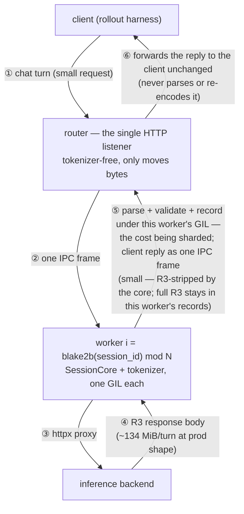
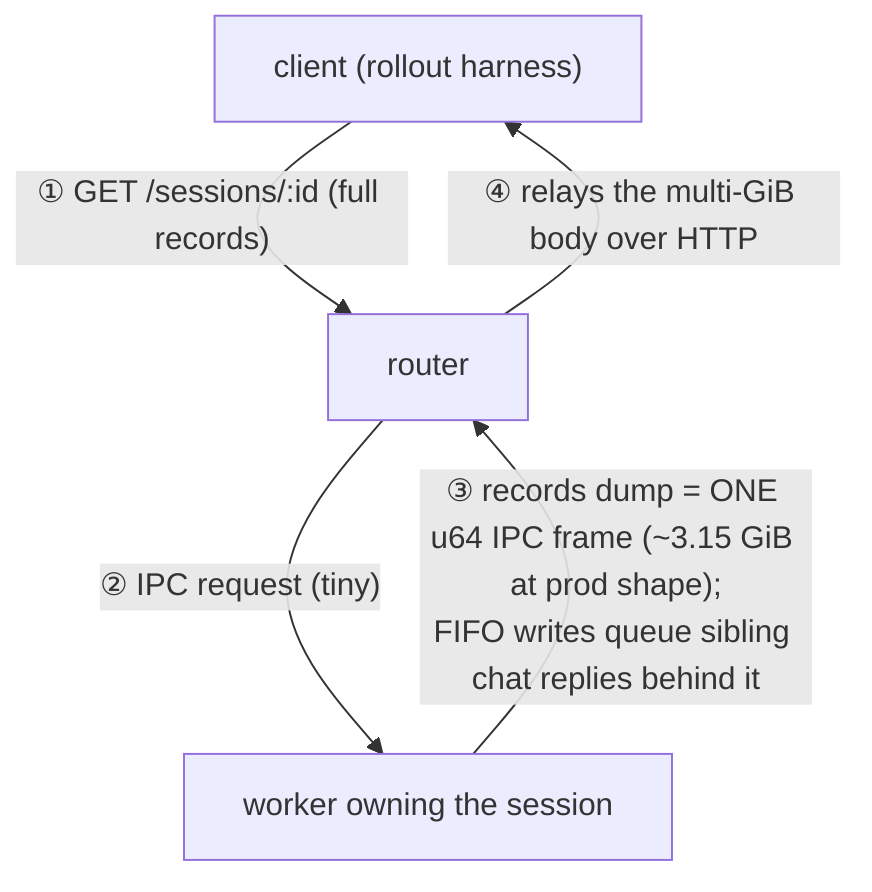

# Multi-process session server — requirements

This is the demands-and-targets spec for the opt-in multi-process session server. The multi-process session modules (`core.py`, `sharding.py`, `ipc.py`, `router.py`, `worker.py`, and `supervisor.py`, which lands with the control plane) carry `# doc-dev: docs/developer/multi-process-session-server.md` and must conform to it; their per-file mechanics live in their header docstrings. Enforcement points outside the flagged set: `linear_trajectory.py` (the collision guard in `SessionRegistry.create_session`, the per-session lock / `closing` gate), the `rollout_manager` `check()` call sites, and `--session-server-workers` in `arguments.py`.

## Goal

Multi-turn agent rollouts must not be bottlenecked by the session server. Under R3 (`routed_experts` / `indexer_topk`) every chat turn returns a 100+ MiB body, and its `json.loads` + validation is pure-Python, GIL-bound work — a single process serializes every session's parse on one event loop, and threads add no parse throughput under the GIL. What we want is session throughput that scales with CPU cores; the only lever is more interpreters. So: shard sessions across worker processes, one GIL each — strictly opt-in, with the single-process server staying the unchanged default.

Measured at the production shape (32 sessions × 50 turns, final-turn body ≈ 134 MiB): 16 workers give **7.2–7.6×** wall-time/throughput over single-process, with the workers pegged (~94% CPU, the intended bottleneck) and the router at ~5% (`tests/benchmark/bench_session_server_overhead.py`, landing separately).

## Functional requirements

- **Default path unchanged.** `--session-server-workers=1` keeps today's single-process server, behavior-identical; multi-process is strictly opt-in.
- **Process-stable sticky routing.** Sessions are stateful (the TITO trajectory accumulates across turns), so every turn of a session must reach the same worker; router and workers must agree on the owner of a `session_id` without coordination — a stable hash modulo worker count, never the builtin `hash()` (salted per process by `PYTHONHASHSEED`).
- **TITO correctness under concurrency preserved exactly.** The per-session `asyncio.Lock`, the `closing` re-checks, and the `num_assistant`-mismatch skip path in `SessionCore.chat_completions` must remain.
- **Worker death is a hard, fast error.** A dead worker owns a hash shard, so an undetected death turns every request to that shard into a black hole; the supervisor's `check()` must be called at the start of **both** `generate()` and `eval()` so either phase fails loudly instead of hanging.
- **No orphan processes** on crash or teardown.
- **The router only moves bytes.** It never `json.loads` a body; it hash-routes to the owning worker and relays the response bytes verbatim — parsing in the router would re-incur the exact cost being escaped.
- **R3 never reaches the client.** `routed_experts` / `indexer_topk` are replay-only training inputs, consumed from the session records via `GET /sessions/{id}` — never from the live chat reply — so the core strips them from client-facing chat responses (landed just below this stack as its own PR). Without the strip every relaying hop pays for the blobs: the single router process measured 100% CPU and capped 16-worker scaling at ~4.6×.

## Required decomposition

- **`SessionCore` (`core.py`) — the logic.** Request primitives in, session mutation + upstream proxy, Starlette `Response` out; knows nothing about processes, sockets, IPC, or HTTP servers; reused unchanged by both chassis.
- **worker (`worker.py`) — one process, one shard.** Exactly one `SessionCore` plus its own httpx proxy backend; speaks IPC only: decode a request, call the core, serialize the `Response` back.
- **router (`router.py`) — the single client-facing HTTP listener.** Hash-routes each request to the owning worker and forwards the reply back unchanged, without ever parsing it; imports neither core nor worker, so the router process stays tokenizer-free.
- **supervisor (`supervisor.py`) — process lifecycle.** Spawns N workers + 1 router, waits for readiness, monitors and fail-fasts on any child death, tears the group down without orphans.
- Support: `sharding.py` (stdlib-only owner function + id minting, importable without FastAPI), `ipc.py` (framed, multiplexed request/reply over one socket per worker), and `SessionRegistry.create_session(session_id=None)` (mints when None; a router-supplied id is created under exactly that id, with a loud collision guard — the single-process path never passes one).

The per-turn chat path — the load the sharding exists for:

The end-of-rollout full-records fetch — same topology, very different byte profile:

The supervisor spawns and monitors the router and every worker and fail-fasts on any death; it is never on a data path.

Sessions are sticky-by-hash, so the chat path only ever carries a single turn's request/response over IPC — never accumulated session state. The records path is the exception: session records are never pruned (the training data path consumes R3 from them), so its reply is the full accumulated dump as one frame — see "Open decisions" for the measured consequences.

## Behavior parity

`workers=N` must match the single-process server's observable behavior, with exactly two known deltas (introduced by the `SessionCore` extraction and inherent to multi-process, where the worker receives already-read bytes over IPC):

- **Body-read timing / lock scope.** The route reads the body before entering `SessionCore.chat_completions` instead of inside `session.lock`; JSON parsing, TITO mutation, and record writes remain under the lock, proxying remains outside it. Consequences: a chat to a missing/closing session consumes the full body before the error returns, and a DELETE-vs-chat race during upload more likely rejects the chat (the outcome was already non-deterministic; the race-condition tests pass).
- **Per-request debug logging removed** (the `debug_request_logger` middleware and two DELETE-path `debug` lines). Logging-only; no contract impact.

## Design targets

- **Observational equivalence.** To a client, `workers=N` is indistinguishable from `workers=1` — statuses, headers, body bytes, and TITO session metadata — on success and error paths alike (the two known deltas above excepted).
- **Deterministic ownership.** Every operation of a session resolves to the same worker for the session's entire lifetime; ownership never depends on process identity, timing, or load.
- **Loud failure.** A dead child never degrades into hangs or partial service: the rollout path fails fast, and teardown leaves no orphans.

## Open decisions and accepted risks

Deliberately cut — reintroduce only with evidence: IPC chunking / round-robin writer / send-buffer budget / configurable frame limits (single-frame bodies instead; reopen rule below); per-worker 503 backpressure, `asyncio.shield` on client disconnect, and the router task-tracking set (cancel-safe request + late-reply drop instead); worker-side `max_inflight` / `max_queued_bytes` admission and the parse-gate semaphore; the prototype's 409 in-flight gate, 500 invariant, and stricter response validation (behavior changes, not part of the mechanism).

- **Records-path head-of-line and router relay ceiling (accepted for now).** Measured with 32 concurrent full-records `GET /sessions/{id}` overlapping chats (w16, production shape): chat reply p99 collapses ~33× (1.6 s → 52 s) and a ~3.15 GiB GET averages ~103 s — the giant reply frame queues sibling chat replies behind it on the IPC channel (FIFO whole frames) and every byte re-serializes through the single router process. The chat path itself never sends large bodies over IPC (the large body is parsed inside the worker); benchmark provenance in "Goal". Accepted for this stack; the fix is decided and lands as a follow-up records-path PR (see "Not covered").
- **Single-frame large bodies.** A full-records `GET /sessions/{id}` reply crosses IPC as one in-memory frame — measured ~3.15 GiB per session at the production shape (records are never pruned, so it grows with turns × body size). This is why frame lengths are u64 with a 64 GiB cap enforced at send time: `_MAX_FRAME` is a corruption guard, not a size feature, and an oversized frame must fail only its own request — if it reached the peer's reader it would be indistinguishable from a corrupt length and tear down the channel, silently poisoning every other session on the shard.
- **No client-disconnect shielding.** A cancelled client request drops only the router-side await (cancel-safe `request()` + late-reply drop); the worker handler runs as a separate task and still commits consistent state — pinned by a deterministic cancel test.
- **No per-request dispatch timeout.** A dead worker surfaces as EOF → 503, but a live-but-hung worker leaves requests pending until the channel closes. Deliberate: `chat`/`proxy` legitimately run long (LLM generation), so a fixed timeout would false-positive on slow chats.
- **Silent session mis-routing is the biggest correctness risk.** If the owner were computed differently at create vs. chat vs. get, sessions would intermittently land on the wrong worker — load-dependent and invisible at `workers=1`; the routing-determinism and equivalence tests exist to catch exactly this.

## Not covered

- Consistent-hashing / rebalanceable routing — v1 is modulo over a stable hash; resizing the worker count at runtime is unsupported.
- A delta / incremental-R3 protocol (would need SGLang/trainer coordination).
- General backpressure / admission control / rate limiting.
- TODO (decided, follow-up records-path PR): worker-direct bulk replies — the router 307-redirects the records GET to the owning worker's own listener, so the multi-GiB records body never crosses IPC or the router. Design and flowchart land with that PR.
