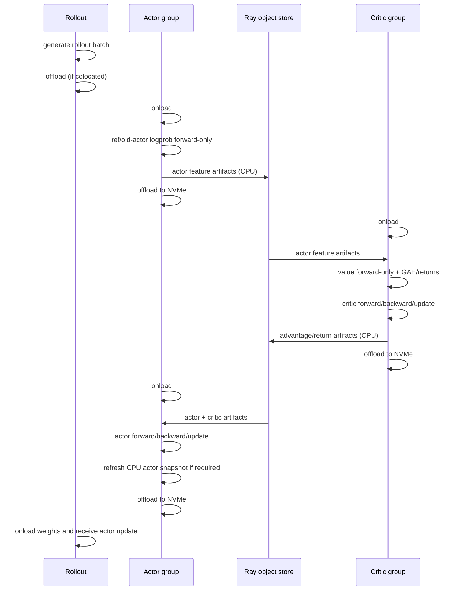

# PPO actor and critic shared-GPU plan

Status: proposed. This document is an implementation plan, not the implementation.

## Summary

Add an opt-in Megatron PPO mode in which persistent actor and critic Ray processes are
pinned to the same placement-group bundles, but their managed CUDA allocations are
never resident at the same time. The PPO iteration becomes a strict sequence of actor
feature computation, critic training, and actor training. CPU/Ray stage artifacts
replace the current live actor-to-critic NCCL broadcasts.

Use the NVMe backend from `torch_memory_saver` commit
[`235b30e9dd2e931d56bdd6cad6ef3b10f943354f`](https://github.com/Zhichenzzz/torch_memory_saver/commit/235b30e9dd2e931d56bdd6cad6ef3b10f943354f)
to spill paused actor and critic allocations to node-local storage in bounded staging
chunks. The initial supported topology requires actor and critic to have the same
world size and parallel/data partitioning. This is the topology the current rank-paired
NCCL exchange already assumes, and it makes stage artifacts safely rank-addressable.

The feature trades GPU count for wall-clock time and local-disk traffic. It does not
make actor and critic training concurrent.

## Current behavior

Miles creates one Ray placement group, but actor and critic use disjoint ranges of its
GPU bundles. With `A` actor ranks and `C` critic ranks, training reserves `A + C` GPUs.
`--colocate` changes rollout/training overlap; it does not overlap actor and critic
bundles.

The synchronous PPO loop starts critic training eagerly and runs actor training at the
same time. Both groups call `wake_up()`, and `sync_actor_critic_data()` uses a two-rank
NCCL process group for each paired actor/critic rank:

- critic broadcasts `values` to actor;
- actor broadcasts log-probabilities and reference log-probabilities when KL needs
  them; and
- both groups compute advantages/returns from their synchronized local batch.

Putting both groups on one GPU without changing this schedule would load both models,
gradients, and optimizer states together and normally OOM. Strictly offloading one side
also makes the NCCL exchange impossible because both endpoints must be online.

## Goals and non-goals

### Goals

- Allow actor and critic Ray processes to share the same physical GPU bundles.
- Enforce exclusive actor/critic CUDA residency with an observable state machine.
- Serialize PPO stages without changing loss, GAE, KL, checkpoint, or weight-version
  semantics.
- Replace live actor/critic NCCL exchange with bounded CPU/Ray artifacts containing
  only per-token/per-sample data, never logits or model state.
- Spill paused TMS-managed allocations to per-node NVMe with bounded pinned-host
  staging memory.
- Keep the existing disjoint, concurrent path as the default.
- Support training/rollout colocation without claiming that NVMe alone removes all
  host-memory copies needed for reference models or actor-to-rollout weight sync.

### Non-goals for the first implementation

- FSDP support.
- Concurrent actor and critic execution on a shared GPU.
- Different actor/critic world sizes or different DP/TP/PP/CP layouts.
- Remote/network filesystems as an offload target.
- Direct Storage/cuFile; the referenced TMS backend uses `pread`/`pwrite` through one
  fixed pinned staging buffer.
- Removing the CPU `TensorBackuper` used for reference/old-actor model switching.
- Streaming actor-to-rollout weights directly from TMS disk files. The referenced
  commit does not expose such an API.

## User-facing configuration

Introduce explicit flags rather than changing the meaning of `--colocate`:

```text
--colocate-actor-critic
--train-offload-backend {cpu,nvme}
--train-nvme-offload-dir /local_nvme/miles/{job_id}/{role}/{rank}
--train-nvme-offload-chunk-mb 256
```

Proposed validation for `--colocate-actor-critic`:

- require `--use-critic`, `--train-backend megatron`, and `--offload-train`;
- require `--train-offload-backend nvme` for the initial rollout of the feature;
- require equal actor/critic world sizes and matching TP/PP/CP/EP/ETP and data
  partitioning;
- require a node-local, writable, role/rank-unique offload directory;
- reject fully colocated rollout plus `--disable-weights-backuper`, because rollout
  weight update happens while the disk-backed actor allocation is paused;
- reject unsupported async training paths until they use the same coordinator; and
- warn that disk capacity must cover both groups' paused managed allocations.

Keep `--colocate` orthogonal: users may enable neither, either, or both forms of
colocation. If both are set, rollout, actor, and critic use the same GPU pool but only
the rollout phase or one training role may own heavyweight CUDA memory at a time.

## Placement design

When actor/critic colocation is disabled, retain today's offsets. When enabled:

1. Allocate one training bundle range of `max(A, C)` GPUs instead of `A + C`.
2. Give actor and critic the same reordered bundle indices, sliced to each group's
   exact world size.
3. Create each Ray actor with the existing fractional GPU request so one actor process
   and one critic process fit in the same one-GPU bundle from Ray's perspective.
4. If rollout is separate, append its bundles after the shared training range. If
   rollout `--colocate` is also enabled, point rollout at the same shared range.

Phase 1 requires `A == C`, so the physical saving is from `2A` training GPUs to `A`.
The placement calculation should still be written in terms of `max(A, C)` so a later
canonical-artifact repartitioning phase can lift the equal-topology restriction.

Ray fractional GPU requests are scheduling/accounting only; they do not enforce CUDA
memory exclusivity. Today actor and critic each request 0.4 GPU and a colocated SGLang
engine requests 0.2, so the all-three combination exactly consumes one Ray GPU bundle.
Preserve or explicitly recalculate these values, assert their sum is at most 1.0 for
every bundle, and add a scheduling test. The coordinator, not the fractions, remains
the real memory-safety mechanism.

Model initialization must also be serialized. Create both lightweight Ray process
sets, then initialize actor, offload it completely, initialize critic, and offload it.
Do not eagerly initialize critic while actor initialization is in progress. Skip
`actor_model.connect(critic_model)` in shared-GPU mode because the live NCCL bridge is
not used. Concretely, branch inside `create_training_models()`: do not create
`eager_create_task(critic_model.init())`, await each role's init/offload transition,
and bypass its unconditional `actor_model.connect(critic_model)` call.

## Exclusive-residency state machine

Add a driver-side coordinator with these states:

```text
ALL_OFFLOADED -> ACTOR_ONLINE -> ALL_OFFLOADED
ALL_OFFLOADED -> CRITIC_ONLINE -> ALL_OFFLOADED
ALL_OFFLOADED -> ROLLOUT_ONLINE -> ALL_OFFLOADED   (when rollout is colocated)
```

Every transition must await the preceding `sleep()`/offload on every rank before
starting the next `wake_up()`/onload. A transition records role, rollout ID, start/end
time, bytes transferred when available, and the TMS pause/resume result. Stage methods
must not independently call `wake_up()` in this mode; lifecycle ownership belongs to
the coordinator.

Use `try/finally` so a failed stage attempts to return its active group to offloaded
state. Treat an offload failure or an exclusivity assertion as fatal rather than
waking the next group and risking OOM. The legacy path keeps its current implicit
wake-up behavior.

The pinned TMS commit calls native `exit(1)` for some pause/resume state violations,
so not every failure is catchable as a Python exception. The coordinator must treat a
dead Ray worker as a fatal transition, report the role/rank and configured spill path,
and never wake the next owner. Per-allocation diagnostics require a follow-up TMS API;
do not promise them in phase 1.

## Serialized PPO lifecycle



The actor is loaded twice per PPO iteration. The critic is loaded once. This is the
minimum schedule that avoids keeping actor and critic resident together while still
computing actor features before GAE and actor gradients after GAE.

`num_critic_only_steps` uses the shorter sequence: critic onload, value/GAE/train,
critic offload. Actor stages remain skipped exactly as today.

## Split training APIs

Retain `train()` for the existing path and add stage-specific methods used only by the
coordinator:

`RayTrainGroup` exposes matching dispatch methods for
`compute_actor_features`, `train_critic_stage`, and `train_actor_stage`. They issue the
role-specific RPC on every rank and return nested `Box` references without resolving
large payloads in the driver. The coordinator calls these methods only after the
corresponding group reaches its online state. During `num_critic_only_steps`, it calls
only `train_critic_stage` with no actor artifact, then offloads critic; actor dispatch
is never scheduled.

### Actor feature stage

`compute_actor_features(rollout_id, rollout_data_ref) -> Box`

- fetch and partition the original rollout batch;
- run reference/teacher/old-actor switching and required log-probability forwards;
- preserve replay record/forward semantics;
- copy only required outputs to CPU (`log_probs`, `ref_log_probs`, teacher data, and
  other enabled per-token replay outputs);
- return a `Box` around a Ray object reference so the driver does not materialize every
  rank's tensors in its own heap; and
- delete GPU batch/intermediates before the group is paused.

R3 replay queues are an explicit exception to artifact transfer: `Replay.record()`
already stores top-k indices in pinned CPU tensors inside the persistent actor process.
They must survive the actor's first offload and be consumed during `replay_backward` in
the second actor stage, then be cleared exactly once. Add a stage-boundary test for
both recorded and rollout-provided replay modes.

### Critic stage

`train_critic_stage(rollout_id, rollout_data_ref, actor_features_ref) -> Box`

- reconstruct the critic's rank-local rollout batch;
- merge the same-rank CPU actor artifact;
- run value forward-only, compute advantages/returns, and train the critic;
- return CPU advantages/returns plus any actor-training fields not reproducible from
  the original rollout; and
- release GPU batch/intermediates before offload.

### Actor update stage

`train_actor_stage(rollout_id, rollout_data_ref, actor_features_ref,
critic_features_ref)`

- reconstruct the actor's rank-local rollout batch;
- merge precomputed actor and critic artifacts;
- do not recompute old/reference log-probability or advantages;
- preserve replay-backward, logging, profiler, optimizer step, ref update interval,
  and actor CPU snapshot semantics; and
- release artifact references after all ranks complete.

Phase 1 maps artifact `rank i` to the same actor/critic `rank i`, but tensor payloads
exist only on the last pipeline stage, matching `sync_actor_critic_data()` today.
Define an explicit empty/sentinel schema for non-last-PP ranks; do not require them to
publish `values` or log-probability tensors they never produce. Last-PP-stage artifacts
include rollout ID, source role/rank, DP partition identity, sample IDs, tensor lengths,
dtype, and a schema version. Validate all metadata before merging so a stale,
wrong-stage, or mispartitioned object fails early.

## NVMe offload integration

Pin Miles' CUDA image dependency to a TMS revision containing commit `235b30e9` (or an
upstream equivalent) and configure actor/critic Ray environments before CUDA/TMS
initialization:

```text
TMS_INIT_ENABLE=1
TMS_INIT_ENABLE_CPU_BACKUP=0
TMS_INIT_ENABLE_DISK_BACKUP=1
TMS_DISK_BACKUP_DIR=<expanded role/rank-local path>
TMS_DISK_BACKUP_CHUNK_MB=<configured chunk size>
```

`RayTrainGroup._allocate_gpus_for_actor()` currently constructs one `runtime_env` for
all ranks. It should set the backend and chunk-size environment there, but it cannot
expand a different role/rank directory per worker. In `MegatronTrainRayActor.init()`,
expand the path after role and rank are known and call
`torch_memory_saver.set_disk_backup_dir()` before
`initialize_model_and_optimizer()` performs managed CUDA allocations. TMS filenames
also contain PID, but role/rank directories make ownership, quotas, and cleanup
auditable.

CPU and disk backup are mutually exclusive for a TMS allocation. The referenced
backend writes each allocation to a reusable file through one fixed pinned staging
buffer, restores it to the same GPU virtual address on resume, and deletes the file
when the allocation is freed. Use a unique job directory and clean stale directories
only when ownership metadata proves they belong to the current/expired job.

Preflight each node before model initialization:

- directory is local and writable;
- available bytes exceed a configurable safety estimate for actor + critic managed
  allocations;
- file/inode limits are sufficient for one file per managed allocation; and
- a write/read probe meets a minimum throughput or emits a prominent warning.

Expose per-stage bytes and pause/resume duration so users can tell whether saved GPU
cost is dominated by NVMe traffic.

### Important CPU-backup boundary

TMS disk-backed allocations return `None` from `get_cpu_backup()`. Therefore a paused
GPU tensor cannot be used as a CPU tensor by the current weight updater. Also,
`TensorBackuper` separately keeps pinned CPU snapshots for actor/ref/old-actor model
switching; TMS NVMe does not replace those snapshots.

The first implementation must use one of these explicit weight-update contracts:

- If rollout uses separate GPUs, update rollout weights while actor is still online,
  then offload actor.
- If rollout shares the training GPUs, retain the current CPU actor snapshot and
  update rollout after actor offload. Require `enable_weights_backuper` for this
  combination.

Do not silently fall back from a missing disk `get_cpu_backup()` to a paused CUDA
pointer. Change `named_params_and_buffers()`/`_maybe_get_cpu_backup()` so device-tensor
fallback is an explicit call-site choice: it is permitted while the actor is online
for separate-rollout weight update, and rejected while a disk-backed actor is paused.
Argument validation must reject the unsafe fully-colocated configuration before the
run starts. A future host-memory reduction can add a supported bucket-streaming API
from TMS files into the weight updater, but that capability is not present in commit
`235b30e9` and is outside phase 1.

## File-level change list

| File | Planned change |
|---|---|
| `miles/utils/arguments.py` | Add flags and compatibility/topology validation; fix colocated rollout GPU count to use the shared training pool. |
| `miles/ray/placement_group.py` | Allocate shared bundle indices, serialize initialization, and skip actor/critic NCCL connection in shared mode. |
| `miles/ray/actor_group.py` | Configure common NVMe TMS environment, preserve valid Ray fractions, and expose stage methods without resolving large artifacts in the driver. |
| `train.py` | Add the exclusive-residency coordinator and serialized PPO schedule; retain the existing concurrent branch. |
| `miles/backends/megatron_utils/actor.py` | Expand/set the per-role/rank TMS directory before allocation; split feature, critic, and actor-update phases; remove implicit wake-up from shared-mode stages. |
| `miles/backends/megatron_utils/update_weight/common.py` | Replace implicit missing-CPU-backup fallback with an explicit online-device versus paused-disk contract. |
| `miles/backends/training_utils/data.py` | Define/validate CPU stage artifact schemas and merge helpers; keep `sync_actor_critic_data()` for legacy mode. |
| `docker/Dockerfile` | Pin a TMS revision that includes the NVMe backend. |
| `tests/fast/` and `tests/e2e/megatron/` | Add placement math, state-machine, artifact, failure, and end-to-end PPO coverage. |

## Correctness and failure handling

- Stage artifacts are immutable and tagged with rollout ID and rank. Never reuse an
  artifact across iterations.
- CPU conversion synchronizes the producing CUDA stream before publishing the Ray
  object.
- Drop artifact references after actor update and verify object-store usage remains
  bounded over many iterations.
- Checkpoint/eval/save operations use the coordinator to onload exactly one required
  training role and restore `ALL_OFFLOADED` afterward.
- On worker restart, use a fresh NVMe job directory and reconstruct artifacts from the
  rollout batch; do not trust partial spill files or stage objects.
- A TMS pause/resume, disk I/O, schema, or exclusivity error aborts the iteration with
  role/rank/path context.
- Native TMS invariant failures may terminate the worker; in that case the driver
  reports the failed role/rank and configured path, but phase 1 cannot guarantee the
  exact allocation/file from the exited process.

## Validation plan

### Unit and CPU tests

- Placement counts and offsets for disjoint training, actor/critic shared, rollout
  shared, and all-three shared configurations.
- Fractional Ray resource accounting for actor (0.4), critic (0.4), and rollout (0.2),
  plus proof that shared bundle indices resolve to the same physical GPU IDs.
- Argument rejection for unsupported backend, missing critic, mismatched topologies,
  non-unique paths, and invalid offload combinations.
- Coordinator transition table, including exceptions during onload, stage execution,
  and offload.
- Artifact round-trip, schema mismatch, rollout mismatch, rank mismatch, and bounded
  driver-memory behavior using mocked Ray objects.
- Last-PP-stage payload and non-last-PP sentinel behavior, including PP>1 actor/critic
  stage exchange.

### TMS integration tests

- Actor-like and critic-like allocations alternate pause/resume for at least three
  cycles with bit-exact contents.
- Peak pinned-host staging memory remains approximately one configured chunk per
  process rather than model size.
- Disk footprint is stable across cycles and files are removed after allocation/process
  cleanup.
- Fault injection for ENOSPC, permission loss, short read/write, corrupt/truncated
  file, and worker death produces an actionable failure without waking the other
  training role.
- Double-pause/double-resume state violations are tested as Ray worker-death scenarios,
  because the pinned native implementation exits instead of throwing to Python.
- Confirm `get_cpu_backup()` returns no usable tensor for disk-backed allocation and
  the Miles weight-update contract rejects unsafe fallback.
- Verify disk mode is selected before the first managed CUDA allocation and remains
  mutually exclusive with TMS CPU backup for the process lifetime.

### End-to-end PPO parity

Extend `tests/e2e/megatron/test_qwen3_4B_ppo.py` with a shared-GPU case after fixing its
currently disabled placement/port conflict. Use identical seed, rollout batch, and
model checkpoints to compare the legacy concurrent path against serialized shared-GPU
mode for:

- actor/critic initial and final weights;
- old/ref log-probabilities, values, advantages, and returns;
- policy/value losses, KL, entropy, gradient norms, and optimizer steps;
- `num_critic_only_steps` behavior;
- checkpoint save/resume and actor-to-rollout weight version; and
- multiple iterations to catch stale Ray artifacts or spill files.

Exact overlap timing differs, but mathematical results should meet the existing PPO
determinism tolerance. Any deviation must be traced to ordering or dtype conversion,
not accepted merely because execution is serial.

### Resource and performance acceptance

Record a timeline of NVML GPU memory, host RSS/pinned memory, Ray object-store use,
local disk bytes, and stage duration. Acceptance requires:

- actor and critic heavyweight GPU residency never overlaps;
- training GPU reservation falls from `A + C` to `max(A, C)` (phase 1: `2A` to `A`);
- host staging memory is bounded by the configured chunk plus explicitly documented
  `TensorBackuper` snapshots;
- disk and Ray object-store use do not grow across steady-state iterations; and
- the PR reports added wall-clock time split into actor resume, critic resume, actor
  second resume, and NVMe transfer.

No universal throughput target is appropriate because NVMe bandwidth and model state
size dominate. The feature should remain opt-in and surface the measured tradeoff.

## Delivery phases

1. Land TMS revision pin, NVMe configuration, preflight, and standalone pause/resume
   tests.
2. Land placement sharing and the exclusive-residency coordinator with mocked stage
   tests.
3. Split PPO training into stage APIs and replace NCCL exchange with versioned Ray
   artifacts for equal topologies.
4. Add actor-to-rollout weight-update handling for separate and colocated rollout
   modes.
5. Run end-to-end parity, long-run cleanup, failure injection, and resource benchmarks;
   keep the feature opt-in.
6. Later, consider unequal topologies via canonical sample-ID artifacts and disk-to-
   weight-updater streaming as separate changes.

## Completion criteria

- Shared mode reserves one actor/critic GPU pool and proves exclusive residency.
- Serialized PPO matches the legacy path within existing numerical tolerances.
- Actor/critic data exchange no longer requires both groups online.
- NVMe pause/resume is bit-correct, bounded in host staging memory, observable, and
  fails safely.
- Rollout weight updates work in both separate-rollout and fully colocated supported
  configurations without dereferencing paused disk-backed CUDA tensors.
- Checkpoint, eval, critic-only warmup, and cleanup paths all pass end-to-end tests.
