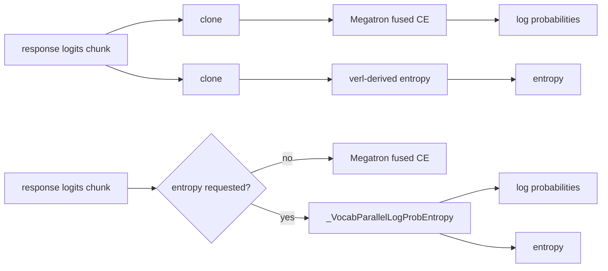

# PPO fused log-probability and entropy plan

Status: proposed. This document is an implementation plan, not the implementation.

## Summary

Port the final behavior of Slime [#2144](https://github.com/THUDM/slime/pull/2144) and
[#2152](https://github.com/THUDM/slime/pull/2152) into Miles for the standard
vocab-parallel PPO path. When entropy is requested, one custom autograd function will
compute log-probability and entropy from a shared softmax and reuse one full-vocabulary
scratch buffer in place.

The dispatch policy is deliberately narrower than a wholesale replacement:

- Keep Megatron's fused vocab-parallel cross entropy when entropy is not requested.
- Use the new fused log-probability/entropy function when entropy is requested.
- Leave Miles' `true_on_policy` implementation unchanged. It has a different SGLang
  scoring contract, padded-vocabulary handling, and replicated-loss gather backward.

This preserves the best existing log-probability-only kernel and limits the numerical
change to calls that currently pay for two independent full-vocabulary passes.

## Motivation

For a packed micro-batch, logits have shape `[T, V_local]`. Slime issue
[#1951](https://github.com/THUDM/slime/issues/1951) reported `T` near 205,000 and a
global vocabulary of 76,000; a single unsharded fp32 `[T, V]` buffer at that size is
about 58 GiB.

Miles currently processes a response chunk as two unrelated operations:

1. `compute_log_probs()` calls Megatron's fused vocab-parallel cross entropy.
2. `_VocabParallelEntropy` computes another distributed softmax for entropy.

When entropy is enabled, this repeats the vocabulary pass and TP reductions, clones
each logits chunk for both paths, and retains two independent autograd states. The
legacy entropy function already contains most of Slime #2152's local optimizations:
it mutates temporary buffers in place, uses a compiled multiply-reduce, and Miles
#1464 avoids entropy backward state when entropy is metric-only. The missing material
optimization is #2144's structural fusion.

The expected Miles benefit is therefore conditional:

- `--use-rollout-entropy`: lower forward-only latency and transient memory.
- `--entropy-coef != 0`: lower forward memory and one combined backward.
- entropy disabled: no behavior or performance change because Megatron fused CE stays
  selected.

This work does not claim to reduce transformer activation memory or the model's
forward/backward peak when the logits processor is not the peak.

## Scope

### Goals

- Compute standard vocab-parallel log-probability and entropy from one softmax.
- Retain Slime #2152's one-buffer in-place implementation and avoid materializing
  `softmax * logits` on CUDA.
- Save entropy-specific full-vocabulary tensors only when entropy contributes a
  gradient.
- Preserve empty batches, token chunking, TP=1/TP>1, CP redistribution, THD/BSHD
  response extraction, and Miles' output shapes.
- Preserve the existing `true_on_policy` numerical contract and backward behavior.
- Establish parity against both the current Miles path and Megatron fused CE before
  enabling the fused path by default.

### Non-goals

- Slime #2076 response/loss-mask row compaction. Miles already extracts response rows
  in `get_responses()`; any additional sparse-row work should be measured separately.
- Changing rollout sampling, temperature application, CP slicing, or R3 replay.
- Replacing Megatron fused CE for log-probability-only calls.
- Fusing the transformer LM head with the logits processor.

## Current and target paths

The fused branch performs one TP MAX reduction, one TP SUM reduction for the softmax
denominator, one TP SUM for the selected token logit, and one TP SUM for the entropy
moment. The current split branch performs the CE collectives and then repeats the
softmax MAX/SUM collectives for entropy.

## Proposed implementation

### 1. Add the fused autograd primitive

Add `_VocabParallelLogProbEntropy` and small rank/all-reduce helpers to
`miles/backends/training_utils/loss_hub/math_utils.py`, adapted from the final Slime
implementation rather than copying the first #2144 revision.

Forward behavior:

1. Convert the local logits view to fp32, matching both existing paths.
2. Derive the local target index and out-of-shard mask from TP rank and local
   vocabulary size.
3. Compute the distributed max, subtract it, and gather the selected normalized
   target logit before overwriting the buffer.
4. Reuse the normalized-logits storage through `exp_()` and `div_()` to produce
   softmax with one full `[T, V_local]` scratch allocation.
5. Compute entropy with `einsum("ij,ij->i")` on CUDA so the full elementwise product
   is not materialized. Keep a normal multiply-reduce fallback for CPU tests.
6. All-reduce the selected target logit and entropy moment and return outputs with
   the same shapes as the current API.

The caller's `vocab_parallel_logits` is read-only even when `.float()` returns the
same fp32 tensor rather than a copy. This is the load-bearing invariant that makes it
safe to remove the caller-side clones: forward and backward may mutate only a derived
`normalized_logits`/softmax scratch buffer, never the raw logits storage or its chunk
view. In particular, do not copy the legacy entropy backward's temporary
`vocab_parallel_logits.sub_()`/`add_()` pattern into the fused function.

Backward behavior:

- Reuse the saved log-probability softmax buffer for its gradient.
- Form the entropy gradient before mutating an aliased softmax buffer.
- Add log-probability and entropy contributions into one logits gradient.
- When `entropy_requires_grad` is false, mark entropy non-differentiable and do not
  save logits, entropy softmax, or the entropy moment.
- Follow Slime's current materialized-`grad_log_prob` behavior; do not reintroduce an
  older `set_materialize_grads(False)` variant without a dedicated unused-output
  backward test.

Miles does not currently pass Slime's `log_prob_keep_mask`. Do not add an unused
masking branch in the first implementation. If replay later needs vocabulary masking,
add it with its own parity matrix because masked log-probability and unmasked entropy
require two different softmaxes.

The standard Miles/Megatron path also intentionally scores the padded local vocabulary
without truncating to `args.vocab_size`; only `true_on_policy` truncates after gather.
The fused standard branch must preserve that behavior for padded-vocabulary models.

### 2. Change only the standard entropy dispatch

Refactor `calculate_log_probs_and_entropy()` as follows:

- `true_on_policy=True`: call `_calculate_log_probs_and_entropy_true_on_policy()`
  exactly as today.
- `true_on_policy=False` and `with_entropy=False`: call `compute_log_probs()` and
  retain Megatron fused CE.
- `true_on_policy=False` and `with_entropy=True`: call the fused primitive once per
  configured `log_probs_chunk_size`.
- Preserve the zero-row result and the current `log_prob`/`entropy` concatenation
  contract.

Remove the two clones from the fused branch. Keep the legacy entropy helper during
development as a test oracle; remove or clearly mark it private once the rollout
fallback decision is made.

No caller API change is required. `get_log_probs_and_entropy()` already passes
`entropy_requires_grad`, and policy loss already sets it to `args.entropy_coef != 0`.
The forward-only model path continues to pass `with_entropy=args.use_rollout_entropy`.

### 3. Preserve the true-on-policy branch

Do not route `true_on_policy` through the new vocab-parallel function in this change.
The current branch intentionally:

- all-gathers and truncates padded vocabulary to `args.vocab_size`;
- matches SGLang's full-vocabulary scoring order; and
- uses `_ReplicatedLossAllGatherLastDim` to avoid scaling gradients by TP size.

Add a regression assertion that selecting the fused standard implementation cannot
change which helper is called in true-on-policy mode.

## File-level change list

| File | Planned change |
|---|---|
| `miles/backends/training_utils/loss_hub/math_utils.py` | Add the fused autograd function; refactor standard dispatch and chunking; retain true-on-policy and logprob-only paths. |
| `tests/fast/backends/training_utils/` | Add CPU single-rank value/backward, empty-input, chunking, and entropy-gradient-gating tests. |
| `tests/fast-gpu/` | Add TP=1 and TP=2 NCCL parity tests against current Miles/Megatron behavior. |
| `tests/fast/utils/test_true_on_policy_logprobs.py` | Prove the existing gather/truncation/backward route is unchanged. |
| `tests/e2e/megatron/` | Add or extend a small deterministic PPO/entropy case and memory/latency benchmark entry point. |

## Validation plan

### Functional matrix

Cover the cross product that changes saved tensors or collective behavior:

- TP size: 1 and 2.
- chunk size: disabled and a size that creates multiple chunks.
- entropy: disabled, metric-only, and gradient-bearing.
- input: normal and zero response rows.
- dtype: bf16 logits with fp32 computation, plus fp32 unit fixtures.
- vocabulary: padded local vocabulary with targets restricted to the real tokenizer
  vocabulary, matching the current standard path.
- layout integration: THD and BSHD response extraction; CP redistribution where
  exercised by existing tests.

For each case, compare:

- log-probability values against Megatron fused CE;
- entropy values against `_VocabParallelEntropy`;
- weighted log-probability gradients;
- entropy-only and combined gradients; and
- `requires_grad`/saved-tensor behavior for metric-only entropy.

Add two targeted regression tests beyond output parity:

- snapshot the input logits, run fused forward and backward, and assert bitwise that
  the caller's input storage was not modified; and
- compare a combined log-probability-plus-entropy gradient against an independent
  analytic/finite-difference reference on a small fixture. This specifically protects
  the required ordering where entropy gradient is formed before the aliased softmax
  storage is reused for log-probability gradient. A generic `gradgradcheck` is not an
  acceptance requirement because the production function casts computation to fp32
  and does not promise higher-order differentiation.

Use strict log-probability tolerances first. Slime's CUDA parity experience suggests
that entropy may require an absolute tolerance around `1e-4` because the reduction
order changes. Measure and report the actual maximum log-probability delta in TP=1 and
TP=2 tests rather than assuming a one-ULP bound. Compare the log-probability gradient
at Megatron fused CE's effective bf16 precision where the legacy CUDA kernel quantizes
it.

### Determinism and R3

Run the existing deterministic training/R3 coverage with entropy disabled and enabled.
Entropy-disabled runs must remain on Megatron fused CE. For entropy-enabled runs, record
the accepted numeric delta explicitly rather than silently updating snapshots. Check
loss, entropy metric, KL, gradient norm, and one optimizer step from the same rollout
batch.

### Performance and memory

Benchmark old and new entropy-enabled paths on the same model, packed token count, TP
size, and `log_probs_chunk_size`. Measure after warm-up:

- p50/p95 logits-processor latency;
- `torch.cuda.max_memory_allocated()` and `max_memory_reserved()`;
- profiler-visible TP collective count; and
- end-to-end forward-only log-probability stage time.

Include at least one long packed batch where logits processing is a visible peak. The
acceptance target is one softmax pass, no second logits clone in the fused branch, and
no material performance regression outside entropy-enabled calls. End-to-end speedup
is a reported result, not a prerequisite if the memory reduction is material.
Include TP=1 inside an initialized DP job as well as standalone TP=1: the helper still
issues collectives on a size-one TP group, so no-op NCCL launch overhead must be visible
in the benchmark rather than hidden by a non-distributed fixture.

## Rollout strategy

1. Land the primitive and parity tests with the fused standard entropy path guarded by
   an internal development switch.
2. Run deterministic/R3 and representative long-context memory jobs.
3. Enable the fused path by default only for standard `with_entropy=True` calls.
4. Keep an internal legacy escape hatch for one release if production scale reveals a
   model-specific numerical issue, then remove it after the soak period.

## Risks and mitigations

| Risk | Mitigation |
|---|---|
| In-place mutation invalidates the LM-head output needed by transformer backward | Treat raw logits as read-only even when `.float()` aliases them; mutate only derived scratch storage and assert input bitwise preservation after forward/backward. |
| Reduction order changes deterministic snapshots | Isolate the change to entropy-enabled standard mode and approve explicit, bounded tolerances. |
| Custom log-probability backward differs from Megatron fused CE | Use CUDA TP=1/TP=2 weighted-gradient parity and compare at the legacy kernel's effective precision. |
| Metric-only entropy retains full-vocabulary state | Assert entropy is non-differentiable and use saved-tensor hooks/memory tests to verify entropy tensors are not retained. |
| Fusion is slower for logprob-only workloads | Never select it when `with_entropy=False`. |
| True-on-policy scoring drifts | Keep its code path unchanged and add dispatch regression tests. |

## Completion criteria

- All functional, backward, true-on-policy, and deterministic tests pass.
- Entropy-enabled standard mode performs one shared softmax and removes the duplicate
  chunk clone/path.
- Metric-only entropy does not retain entropy backward tensors.
- Benchmarks report memory and latency before/after for at least TP=1 and TP=2.
- The PR description documents any accepted numerical tolerance and the measured
  end-to-end impact.
