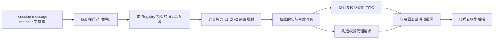

> **状态：** 收窄实现已在本分支落地：保留 matcher hub、selector 解析、完整 JSON 边界体系和 v1/v2 最小接线；未实现 plan/apply 两阶段规划、`SessionRecord.replayed_messages` 审计字段与请求改写机制——匹配完成后由 session 层把 stored 前缀原样加原始重放后缀作为 effective history 传给 TITO，使其严格校验按构造通过。原实现 `f5198e6fb287b6f67b76f982bf37b8eae7ec23a9` 因范围过重，已由 `84492b58706c56de2e6903ff3bc4f663c5294c2a` 完整撤销。
>
> **范围说明：** 下文的“请求表示”“失败行为”等章节描述完整设计；“原实现摘要”和“原实现验证记录”仅记录已撤销方案。两者均不等同当前代码事实，收窄实现以上述状态说明为准。
>
> **冻结代码基线：** `b1860dd264e17c96d5d92da96c957d88cfd3a1f8`（2026-08-06）。

## 摘要

新增一个进程级选项 `--session-message-matcher`，用于控制客户端重放的请求消息何时应被视为等价于 session server 已存储的消息。

该选项接受内置别名或以点分隔的 Python import path：

```text
--session-message-matcher strict
--session-message-matcher loose_tool_call
--session-message-matcher role_content_only
--session-message-matcher my_package.session_matchers.same_message
```

`strict` 是默认值，映射到当前的 `message_matches` 函数。`loose_tool_call` 保留 `strict` 的所有匹配，并只对 `tool_calls[].function.arguments` 增加受控的 JSON-object 表示规范化；tool call 的其余结构仍会比较。`role_content_only` 只按当前规范化规则比较 `role` 和 `content`，并明确忽略其他消息字段。其他任意值都通过 `load_function` 解析为同步 callable。

所有消息匹配策略、selector 解析和严格追加验证集中在新的 `miles/utils/chat_template_utils/message_matcher_hub.py`。`template.py` 继续负责模板加载与渲染，不再拥有 session 消息身份策略。

消息匹配器是一项复用策略，而不是只做表面检查的验证 hook。返回 `True` 只表示复用决策所需的消息等价性条件成立；是否复用仍取决于其余前置条件。复用还要求部署方保持请求级渲染输入兼容，例如 `tools` 和实际生效的 `chat_template_kwargs`；这个仅接收消息的接口不会验证这些输入。

## 动机

一些 agent harness 不会原样重放模型消息。它们可能解析并重新序列化工具参数、将空的 `arguments` 字符串替换为 `"{}"`，或在下一次请求中省略 `reasoning_content`。这些转换可能保留 harness 所期望的对话语义，却会改变当前消息匹配器所比较的字段。

目前，这类变化会产生结构性后果：

- Session v1 会检测到分歧，并可能回滚已生成的 checkpoint；如果回滚过深，还可能拒绝请求。
- Session v2 会挂接到更浅的节点或创建新根节点，从而改变谱系，并可能生成另一个样本。

实现不能只修改 session 层消息匹配器，否则 TITO 验证仍可能拒绝 session 层已经接受的前缀。已撤销方案通过纯规划阶段确定一次 `effective_messages`，并让 TITO、代理请求、主记录和提交状态统一使用该结果；后续实现需要重新判断是否有更窄的方式满足同一一致性要求。

服务器需要一项明确且稳定的策略，供部署方针对已知 harness 进行选择，而不是在 Miles 中嵌入特定于 harness 的重写逻辑。内置 `loose_tool_call` 只处理已知的 tool-call 传输表示差异；`role_content_only` 为明确愿意把其他字段排除在 session 身份之外的部署提供更宽松的内置策略；更细的规则仍由自定义 import path 定义。

## 目标

- 默认保持当前匹配行为。
- 为当前行为、只规范化 `tool_calls[].function.arguments` 的兼容行为，以及只比较 `role` 和 `content` 的高风险兼容行为提供短名称。
- 允许受信任的部署提供自定义消息匹配器，而不需要再向 Miles 增加一种专用模式。
- 把消息匹配策略及其 selector 解析集中在独立 hub 中，使模板渲染代码不再承担 session 策略注册职责。
- 仅在 v1 和 v2 共用的纯前缀分类阶段使用同一个已解析消息匹配器，并缓存该阶段的所有匹配结果；随后把唯一的实际生效历史传给每条 TITO 路径，而不是让下游各层再次分类前缀。
- 当 Miles 保留由已存储前缀生成的 token IDs 时，防止重放前缀替换权威的已存储前缀。
- 当消息匹配器配置或执行无效时，在修改 session 状态前清晰地失败。

## 非目标

- 自动检测 Strands、OpenAI Agents、LangChain 或其他任意 harness。
- 证明任意两条消息在每个已配置 chat template 下都会渲染为相同 token。
- 规范化请求级 `tools` 数组、`chat_template_kwargs` 或各条消息之外的其他请求字段。
- 允许某个请求或单个 session 更换消息匹配器。
- 修改 v2 样本选择、样本后处理、重试保留或奖励行为。
- 在此功能中一并修复当前 `message_matches` 实现遗漏的所有字段。
- 重构 `template.py` 中与消息匹配无关的模板加载、tool 参数转换或渲染逻辑。
- 让 `loose_tool_call` 同时放宽 `reasoning_content`；只想选择性放宽 reasoning 而不忽略其他字段的部署应使用自定义消息匹配器，愿意只保留 `role` 和 `content` 的部署可显式选择 `role_content_only`。
- 让 `role_content_only` 判断或修复被忽略字段；该模式只投影字段，并让已存储前缀在匹配后保持权威。
- 对自定义 Python 代码进行沙箱隔离，或使异步消息匹配器能够安全地在 session server 事件循环上运行。

## 冻结基线行为

在冻结基线上，`miles/utils/chat_template_utils/template.py::message_matches` 比较 `role`、`content`、`reasoning_content` 和 `tool_calls`，而不是比较整个消息字典。

冻结基线会把被比较顶层字段中的缺失值、`None`、`""` 和 `[]` 视为等价。它还会在比较前删除每个嵌套 tool call 中的 `index`，然后使用 Python 相等运算比较剩余的 tool-call 列表。除此之外，tool-call 顺序、ID、名称和参数表示形式都会影响比较结果。

冻结基线中的消息匹配器参与三种不同的决策：

- `LinearTrajectory` 使用它寻找 v1 回滚前的公共前缀。
- `SessionTree` 使用它寻找最深的 v2 挂接点。
- `assert_messages_append_only_with_allowed_role` 在 TITO 追加 token 前使用它，其中也包括 DeepSeek V4 override。

这三者构成同一个逻辑策略面。仅修改其中一个调用点，会导致某一层接受另一层拒绝的前缀。

此外还存在一个独立的既有正确性问题：一些内置渲染器会读取当前消息匹配器忽略的消息字段。Kimi 和 Inkling 使用顶层 `name` 或 `tool_call_id`；MiniMax 使用 `current_date` 和 `current_location`；仓库内随附的 DeepSeek V3.2 encoder 使用消息级 `tools` 和 `response_format`。本设计中的 `strict` 别名表示“保留当前函数”，而非“完整的模板等价性”。这个问题应单独修复和评审，避免被隐藏在兼容性 hook 中。

## 命令行接口

接受的值遵循以下语法：

```text
session_message_matcher := "strict" | "loose_tool_call" | "role_content_only" | dotted_import_path
```

参数定义会保留原始字符串，并且不使用 `choices`，因为 `choices` 会拒绝自定义路径。当启用的 session server 构造其路由和共享 session 资源时，解析只执行一次。

在 `args` 中保留原始选择值，既遵循 Miles 对 import-path hook 的现有约定，也避免把 Python 函数对象放入可能跨越进程边界的配置中。

别名必须精确匹配并区分大小写。非别名值必须是以点分隔的 import path，例如 `my_package.matchers.same_message`；对于没有 module 部分的拼写错误，启动时应给出有针对性的错误，其中列出三个别名以及预期的路径格式。

### 解析表

| 选择值 | 解析得到的 callable | 匹配行为 |
|---|---|---|
| `strict` | 现有 `message_matches` | 使用当前规范化规则比较当前与模板相关的 key 集合。 |
| `loose_tool_call` | 新的内置 tool-call 语义匹配器 | 保留 `strict` 的匹配，并只对 `function.arguments` 增加受控的 JSON-object 表示规范化。 |
| `role_content_only` | 新的内置字段投影匹配器 | 只按当前规范化规则比较 `role` 和 `content`，忽略其他消息字段。 |
| 其他任意点分路径 | `load_function(selector, sync_required=True)` | 按下述契约执行部署方提供的消息匹配器。 |

服务器在启动时记录一次选择值和解析得到的 callable。正常匹配期间不会记录完整消息。

## 消息匹配器契约

自定义消息匹配器在概念上具有以下函数签名：

```python
def matcher(stored_message: dict[str, Any], replayed_message: dict[str, Any]) -> bool:
    ...
```

`stored_message` 是已有 token IDs 所表示的权威消息。`replayed_message` 是当前客户端请求在同一历史位置提供的消息。

返回值有意承载较强的消息级语义：

- `True`：消息匹配器断言，在满足下述独立渲染输入前提的条件下，可以使用已存储消息作为前缀复用和 v2 路径身份的权威消息。
- `False`：在当前策略下，这两条消息存在分歧，因此继续执行正常的 v1 回滚或 v2 分支逻辑。

该 callable 必须满足以下所有要求：

- 返回真正的 `bool`；会被判真的非布尔值属于配置错误。
- 保持同步、确定性、无副作用且执行迅速。
- 绝不修改任一输入字典或其嵌套值。
- 不执行阻塞 I/O，因为匹配会在服务器事件循环上持有 per-session lock 时同步运行。
- 在整个进程生命周期内保持语义稳定。

由于同一个消息匹配器还参与定义 v2 树身份，它必须在消息集合上定义确定、自反、对称且传递的关系。Miles 无法在启动时证明这些性质，因此它们属于受信任自定义函数的契约。单向的重放谓词需要一个独立的 v1-only 接口，不在本提案范围内。

消息匹配器不会接收请求级 `tools`、tokenizer、模板或 `chat_template_kwargs`。部署方必须保证这些前缀渲染输入在复用期间保持稳定，或者独立证明实际配置的渲染器会生成兼容前缀。消息层面的 `True` 结果本身不能证明完整的 prompt-token 等价性。

对于 `role_content_only`，`True` 尤其不表示 tool-call 或 reasoning 语义等价；它只表示部署方选择用 `role` 和 `content` 的投影决定身份，并接受已存储前缀取得权威性的后果。

自定义消息匹配器代码属于受信任的服务器代码，与其他 Miles import-path hook 拥有相同权限。该接口不是安全边界。

## 内置行为

三个内置 selector 的匹配集合满足 `strict ⊆ loose_tool_call ⊆ role_content_only`。后一个模式不会把前一个模式已经接受的消息改判为不匹配，但会接受更多差异。

### `loose_tool_call`

`loose_tool_call` 是 `strict` 的兼容性超集：它先调用当前 `message_matches`，若结果为 `True` 就直接返回 `True`。只有 `strict` 返回 `False` 时，它才按下述规则尝试接受 `function.arguments` 的表示差异；因此，切换到该模式不会把当前已经匹配的消息改判为不匹配。

简化后的心智模型是：`loose_tool_call(a, b) = strict(a, b) or same_tool_call_structure_with_equivalent_json_arguments(a, b)`。

1. 对 `role`、`content`、`reasoning_content` 和顶层 `tool_calls` 的空值继续沿用当前规则，并保留 tool-call 列表的长度和顺序。
2. 对每个 tool call 沿用当前规则，删除仅属于传输表示的顶层 `index`。
3. 除 `function.arguments` 外，其余结构和字段都按当前规则比较，包括字段是否存在、call `id`、`type`、`function.name`、列表顺序以及 call 或 function 层的未知扩展字段。
4. `function.arguments` 的 `None`、精确空字符串 `""`、空 `dict` 和合法的空 JSON object 字符串统一为同一个空 object 表示。
5. 其他非空字符串只有在它是不包含重复 key、NaN 或 Infinity 的合法 JSON object 时才解析；JSON-compatible `dict` 直接进入同一流程。object key 顺序递归忽略，array 顺序保留；string、number、boolean、null、array 和 object 等 JSON 类型不能互换，布尔值也不能因 Python 的相等规则与数字互等。
6. 缺失的 `arguments`、纯空白字符串、顶层 array 或 scalar、无效 JSON、包含重复 key、NaN 或 Infinity 的 JSON，以及非 JSON-compatible `dict` 都不做修复，只按原始值和类型比较。规范化过程不得抛出请求级异常，也不得修改输入。
7. 第 5、6 项的类型敏感规则只决定 `strict` 原本不接受的新匹配；`strict` 已经接受的 Python 相等性边角行为由首个兼容性步骤保留，修正这些既有行为不在本提案范围内。

这个预设针对已知上游重新序列化行为设计，并把新增的放宽限制在 `function.arguments` 的 JSON-object 表示层。它不会把函数名、参数语义、call ID、调用顺序或其他未知字段当成可丢弃的重放元数据。

该规范化的目标是减少语义相同 tool call 的假阴性，而不是通过省略语义字段来提高命中率。部署方仍需针对确切的模板和模型协议证明，以已存储前缀替换重放前缀可以保留预期模型上下文；Miles 无法仅从两条消息推断这一前提。

### `role_content_only`

`role_content_only` 不调用 `strict`，而是只对 `role` 和 `content` 分别执行当前 `_normalize_value(stored.get(key)) == _normalize_value(replayed.get(key))` 比较。每个字段的缺失值、`None`、`""` 和 `[]` 因此属于同一个空值类；其他值不做 trim、大小写转换、Unicode 规范化或 JSON 规范化，直接沿用 Python 相等运算。该规则对所有 role 一视同仁，不增加按 role 分支。

该模式不会读取或验证 `reasoning_content`、`tool_calls`、`name`、`tool_call_id`、`current_date`、`current_location`、消息级 `tools`、`response_format` 或其他任意字段。它不会解析 malformed tool calls，也不会修改输入。由于它只是对规范化后的字段投影做相等比较，因此仍然定义了确定、自反、对称且传递的关系。

选择该模式等于部署方声明：对同一位置的消息而言，只有 `role` 和 `content` 决定 session 身份；被忽略字段即使不同，也应由已存储消息和 token 前缀取得权威性。它会有意把 `role="assistant"`、空 `content` 但函数名、arguments 或 call ID 完全不同的 tool-call 消息判为相同，也会把 `content` 相同但 `name` 或 `tool_call_id` 不同的 tool-result 消息判为相同。该策略只能显式启用，Miles 不会根据模型或 harness 自动选择它。

### 行为对比

| 已存储消息与重放消息之间的差异 | `strict` | `loose_tool_call` | `role_content_only` |
|---|---:|---:|---:|
| 只有嵌套的 `tool_calls[].index` 发生变化 | 匹配 | 匹配 | 匹配 |
| 同一个 JSON object 以不同空白、转义或数值拼写重新序列化 | 不匹配 | 匹配 | 匹配 |
| JSON object 的 key 顺序发生变化 | 不匹配 | 匹配 | 匹配 |
| arguments string 与等价的 `dict` 互换 | 不匹配 | 匹配 | 匹配 |
| `None` 或 `""` 形式的空工具参数变为 `"{}"` | 不匹配 | 匹配 | 匹配 |
| 缺失的 arguments 变为 `"{}"` | 不匹配 | 不匹配 | 匹配 |
| 纯空白 arguments 变为 `"{}"` | 不匹配 | 不匹配 | 匹配 |
| 非空 `reasoning_content` 被省略 | 不匹配 | 不匹配 | 匹配 |
| `content` 发生变化 | 不匹配 | 不匹配 | 不匹配 |
| `role` 发生变化 | 不匹配 | 不匹配 | 不匹配 |
| call `id`、`type` 或 `function.name` 发生变化 | 不匹配 | 不匹配 | 匹配 |
| tool-call 列表顺序发生变化 | 不匹配 | 不匹配 | 匹配 |
| arguments 的 JSON 类型、值或嵌套 array 顺序发生变化，且 `strict` 原本不匹配 | 不匹配 | 不匹配 | 匹配 |
| arguments 是无效 JSON 且原始表示不同 | 不匹配 | 不匹配 | 匹配 |

## 所有权和数据流

### 模块边界

`miles/utils/chat_template_utils/message_matcher_hub.py` 是消息匹配策略的唯一实现所有者。它定义 `SessionMessageMatcher` 类型别名、现有严格函数 `message_matches`、两个内置宽松 matcher、私有 alias map、`resolve_session_message_matcher(selector)`、所有 matcher 专用的常量和规范化 helper，以及与 `_TEMPLATE_RELEVANT_KEYS` 强耦合的 `assert_messages_append_only_with_allowed_role`。

hub 必须保持为单向依赖的底层模块：它可以依赖 Python 标准库，并在 resolver 被调用时于函数内部延迟导入 `load_function`；它不能导入 `template.py`、package root、TITO 或任何 session 模块。延迟导入避免普通模板渲染或 matcher 单元测试仅因 selector 扩展口而在模块加载时引入 `miles.utils.misc` 及其 Ray 依赖。

`template.py` 继续拥有 `load_hf_chat_template`、`apply_chat_template_from_str`、`apply_chat_template`、`normalize_tool_arguments` 和其他渲染 helper。

首个迁移版本在 `template.py` 中通过直接 alias re-export `message_matches` 与 `assert_messages_append_only_with_allowed_role`，不保留第二份实现，也不添加 wrapper。`miles.utils.chat_template_utils.__init__` 按 hub、template、TITO 的顺序导入，并从 hub 导出这两个现有名称。仓库内部的新导入直接指向 hub，旧的 package-root 导入保持兼容；新 matcher 与 resolver 只从 hub 暴露，不扩大 package-root API。

CLI 参数定义、`SessionRegistry`、prepared-request 状态、`SessionMessageMatcherError`、HTTP 映射、日志和运行时返回值检查仍属于 arguments 或 session 层，不进入 hub。私有 alias map 只描述内置名称到函数的静态映射；当前选中的 matcher 不存储为 hub 的可变模块全局状态。

session-server 组合根只调用一次 hub 的 resolver。`SessionRegistry` 是实际选择值和不可变 callable 的唯一运行时所有者；每个核心对象都会将该 callable 显式传入自己的纯请求规划函数。`LinearTrajectory`、`SessionStateV2`、`SessionTree` 和 TITO tokenizers 都不会读取选中 matcher 的模块全局变量。



同一服务器进程中的所有 session 都使用同一个消息匹配器。更换选择值需要先排空流量再重启 session server；这会终止其内存中的 session，从而避免在既有 v2 树下方改变身份关系。

### 请求表示

请求准备阶段维护三种彼此独立的表示，而不是针对所有用途修改同一个字典：

1. `replayed_messages` 是确定权威前缀之前，从客户端收到的消息列表副本。
2. `effective_messages` 是权威的已存储前缀与未匹配重放后缀的拼接结果。
3. `effective_request_body` 是服务器规范化后的代理请求体，其中 `messages=effective_messages` 并带有与之匹配的 `input_ids`；它会被发送给模型后端，并存储为主要的 `SessionRecord.request`。

当重放内容与 `effective_messages` 不同时，`SessionRecord` 会新增一个可选且命名明确的 `replayed_messages` 审计字段。该审计字段描述客户端重放的内容，而不是发送给模型的上下文。让主记录保持权威，可以维持现有的样本组装不变量：`record.request["messages"]` 与 `record.request["input_ids"]` 描述的是同一个实际生效请求。

当 `replayed_messages` 为 `None` 时，公开的 `GET /sessions/{id}` 序列化器会完全省略该字段，从而为完全相同的重放保持现有 JSON 结构。如果接受了内容不完全相同的重放，响应会在权威 `request` 旁以顶层消息列表的形式包含 `replayed_messages`。Session 样本编码继续使用权威的主要请求，不会暴露审计字段。

### 权威的已存储前缀

请求规划区分两个长度：

- `common_match_len` 是消息匹配器为候选已存储路径连续接受的消息对数量。它可用于分歧检测和诊断，但自身不会自动定义可复用边界。
- `reuse_prefix_len` 是实际可复用 token snapshot 的结束位置：v1 使用选定的 generated-checkpoint 消息边界，v2 使用选定完整 attach node 的已匹配消息长度。

如果 `C` 是截至 `reuse_prefix_len` 的权威已存储历史，而 `S` 是从同一索引开始的重放请求，Miles 会按下式构造实际生效历史：

```text
effective_messages = C + S
```

`role_content_only` 不会重写重放后缀，也不会协调跨越 `C` 与 `S` 边界的 tool-call 引用。例如，如果 `C` 中权威 assistant 消息的 call ID 是 `A`，而被接受的重放前缀将其改为 `B`，则引用 `B` 的新 tool-result 后缀仍会原样进入 `S`，最终形成 stored call `A` 与 replayed result `B` 的组合。选择该模式的部署方必须保证这类组合仍符合其协议；Miles 不执行 ID reconciliation。

Miles 绝不能仅仅因为消息匹配器接受了某些消息，就保留超出可复用 checkpoint 或 node 边界的已存储消息。例如，如果 v1 匹配到了一个工具结果，但必须回滚到其前一个已生成 assistant checkpoint，那么该工具结果应来自重放后缀，并重新渲染。实际生效的代理请求、主记录、session 状态、TITO 渲染以及未来的路径匹配都只使用权威的可复用前缀；需要审计时，`SessionRecord.replayed_messages` 会保留完整的客户端消息列表。

对于 v1，请求准备必须在成功响应的提交期间持续携带权威的 `effective_messages`，而不是把原始重放前缀赋给 `LinearTrajectory.messages`。

对于 v2，选定 parent 的路径本身已经是权威表示。新 node 只存储未匹配的请求后缀和生成的 assistant response，因此消息匹配器判为等价的重放表示差异不会进入树中。

任何渲染完整历史的 TITO 实现（包括 DeepSeek V4）都会接收权威的实际生效历史。这可以避免重新渲染一处已被接受的重放表示差异，再把结果与来自另一份已存储前缀的 token IDs 组合起来。

针对 `chat_template_kwargs` 按请求创建的副本不持有也不调用消息匹配器。它们会接收已经确定为权威表示的 `effective_messages`，因此基础 TITO 与 DeepSeek V4 等完整历史 override 会针对同一个前缀进行验证和渲染，而不会重新执行自定义代码。

## 失败行为

启用 session 路由时，所有解析失败都属于启动失败：import 错误、缺失属性、不可调用对象或协程函数都会阻止服务器接受 session 流量。

如果自定义消息匹配器在运行时抛出异常或返回非布尔值，Miles 会在向模型后端发起代理请求之前抛出专用的 `SessionMessageMatcherError`，并返回 HTTP 500。Miles 不会把该失败解释为匹配或不匹配，也不会回退到其他消息匹配器。

每个请求都会在持有 session lock 期间经历两个准备阶段。纯规划阶段会评估并缓存每个消息匹配结果、验证返回值是精确的布尔值、选择提议的 v1 rollback checkpoint 或 v2 attach parent、构造 `effective_messages`，并基于 state snapshot 完成 TITO prompt 构造。只有上述步骤全部成功后，应用阶段才会修改 v1 rollback state 或 v2 active view。对于同一个请求，下游不会再次调用自定义消息匹配器。

这一保证覆盖消息匹配器和 TITO 准备失败。经过验证的规划一旦被应用且代理请求已经开始，现有的上游失败和并发提交行为保持不变。

正常的 `False` 结果不是错误。它保留现有的 v1 回滚和 v2 分支行为。

## 安全性分析

假阴性可能触发 v1 回滚或拒绝请求，或者创建一条新的 v2 谱系。假阳性更严重：Miles 可能会让已存储消息对语义不同的重放具有权威性，或者 v2 可能会挂接到错误的 parent 并继续扩展。

`loose_tool_call` 不会通过丢弃 `tool_calls` 来换取命中率。除首个 `strict` 兼容性步骤继承的既有行为外，它仍比较 call `id`、`type`、`function.name`、调用顺序和未知扩展字段，并要求 `function.arguments` 规范化后的 JSON 类型和值相同；因此，函数名、参数语义或 call ID 不同的空 `content` assistant 消息不会产生新的匹配。

相对于 `strict`，该预设新增的等价关系只覆盖 `function.arguments` 的受控表示规范化；嵌套 `index` 是两种模式都继承的当前行为，并非新增放宽。剩余风险在于部署方必须确认 JSON object 的重新序列化和空参数规范化不会改变其模型协议中的含义。Miles 绝不能根据 model 或 harness 名称自动选择该预设。

`role_content_only` 则有意接受更大的假阳性集合。只要 `role` 和 `content` 匹配，完全不同的 tool call、reasoning、tool-result 归属或其他模板可见字段都会被折叠为同一个 v1 前缀或 v2 路径。最危险的情况是被忽略的 call ID 变化与未匹配后缀中的 tool-result 引用发生交叉：权威已存储前缀和原始重放后缀可能形成悬空引用，而逐消息匹配器既看不到完整对应关系，也不会重映射 ID。

因此，选择 `role_content_only` 不只是声明“这些字段无需比较”，还表示部署方接受 stored-wins 语义，并保证任何未匹配后缀与权威已存储前缀仍然协议兼容。CLI 帮助和用户文档必须把它标记为高风险的显式 opt-in；Miles 不会把它作为错误回退，也不会根据模型或 harness 自动启用。

不安全的自定义消息匹配器仍可能产生假阳性。import-path 扩展口是合适的，因为特定于 harness 的不变量由部署方而非 Miles 负责。

当前 `strict` 消息匹配器对某些模板使用但被忽略的字段也存在已知假阳性，两个宽松模式都会继承这些已匹配消息。本提案为保持模式单调性而保留该行为；它并不证明当前消息匹配器已完整覆盖 token 等价性。未来修正 `_TEMPLATE_RELEVANT_KEYS` 时，应同步收紧 `strict` 和 `loose_tool_call`；`role_content_only` 的固定契约仍只投影 `role` 和 `content`，除非另行作出破坏该模式语义的设计决策。

## 考虑过的替代方案

### 布尔型宽松 flag

拒绝，因为布尔值无法说明忽略哪些差异，而且当前消息匹配器已经执行规范化比较，并非完整字典相等。

### 可配置的相关 key 列表

不作为主要扩展方案，因为扁平的顶层列表无法表达嵌套 tool-call 规范化、特定于 role 的规则、单向重放行为或模型家族差异。它会为一项涉及 token 复用安全性的决策暴露一个看似简单、实则具有误导性的配置。

### 把仅比较 `role` 和 `content` 的行为并入 `loose_tool_call`

拒绝，因为两种行为对应不同的风险预算。`loose_tool_call` 应继续验证 tool-call 身份和参数语义；更宽的字段投影以独立且名称直白的 `role_content_only` 暴露，使部署方必须明确选择相关的谱系与跨消息引用风险。

### 分开的内置模式和自定义路径 flag

拒绝，因为两个 flag 会引入优先级与冲突规则。单一的选择值命名空间可以自然地同时支持别名和 import path。

### 仅支持自定义路径

拒绝，因为现有行为需要一个稳定的默认名称，而两种已选兼容行为需要可审计且稳定的名称，不应要求每个部署重复实现。两个内置宽松预设仍然必须显式启用，并承担各自在本文中定义的安全契约。

### 在 Miles 内进行特定于 harness 的规范化

拒绝，因为 harness 行为会独立于 Miles 发生变化，而且服务器无法可靠识别请求由哪一种转换产生。

### 按请求选择消息匹配器

拒绝，因为在同一个 session 内改变等价关系会导致此前的 v2 树身份和 v1 回滚决策不一致。它还会允许不可信的请求数据选择服务器侧代码。

### 消息匹配器失败后的回退

拒绝，因为回退到 `strict`、`loose_tool_call`、`role_content_only` 或自动判为不匹配，会在配置错误发生后静默改变谱系语义。

### 把 matcher registry 留在 `template.py`

拒绝，因为 selector 解析、可插拔 Python 代码和 session 身份策略都不是模板渲染职责。继续放在 `template.py` 会迫使 renderer 模块同时承担策略注册和 import-path 加载，并使新增 matcher 测试与庞大的模板依赖绑定；独立 hub 可以保持单向依赖，同时通过直接 alias 保留现有导入兼容性。

## 原实现摘要（已撤销）

已撤销的 `f5198e6fb287b6f67b76f982bf37b8eae7ec23a9` 曾按以下清单实现。这些条目记录历史方案，不构成后续实现要求：

1. 添加字符串参数 `--session-message-matcher`，默认值为 `strict`，且不设置 `choices`。
2. 新建 `miles/utils/chat_template_utils/message_matcher_hub.py`，把 `_TEMPLATE_RELEVANT_KEYS`、matcher 专用规范化 helper、当前 `message_matches` 和 `assert_messages_append_only_with_allowed_role` 从 `template.py` 移入该文件。
3. 在 hub 中添加 `SessionMessageMatcher`、内置 `loose_tool_call` 与 `role_content_only`、`strict` 兼容性快速路径、不修改输入的 tool-call 规范化器、只投影 `role` 和 `content` 的匹配函数、私有 alias map，以及 `resolve_session_message_matcher(selector)`；resolver 先映射别名，再延迟导入并调用 `load_function(..., sync_required=True)`。
4. 让 `miles.utils.chat_template_utils.__init__` 从 hub 导出现有公共名称；让 `template.py` 通过直接 alias 暂时 re-export 两个被移动的现有名称，并把 `tito_tokenizer.py` 等仓库内部引用改为直接从 hub 导入。不要复制实现或增加 wrapper。
5. 在 `setup_session_routes` 中只解析一次，将选择值和 callable 存储到 `SessionRegistry`，并由每个 core 显式把 callable 传给 v1 或 v2 请求规划；不要修改模块级默认值，也不要把消息匹配器放到每个 session 的状态上。
6. 引入纯计算的 prepared-request 规划：缓存消息匹配结果、记录 `common_match_len`、从 v1 checkpoint 或完整 v2 node 中选择版本特定的 `reuse_prefix_len`、构造权威的 `effective_messages`，并在修改任何 view 之前完成 TITO prompt 构造。
7. 保留 TITO 内现有的严格追加验证，但向其提供已由构造保证存储前缀完全一致的权威消息。因此，按请求创建的副本和 DeepSeek V4 使用相同的权威历史，既不持有也不再次调用自定义消息匹配器。
8. 使用权威消息和匹配的 `input_ids` 构造 `effective_request_body`，并将其用于后端和 `SessionRecord.request`；同时添加可选的 `SessionRecord.replayed_messages`，保存客户端确定权威表示之前的消息列表。
9. 只有在消息匹配器和 TITO 验证成功后，才应用准备好的 v1 rollback 或 v2 活跃视图变更；将自定义消息匹配器执行失败包装为 `SessionMessageMatcherError`。
10. 在启动时记录解析得到的选择值；每个已准备请求如果接受了任何非完全相同的消息，则发出一条不包含内容的 INFO 事件，其中包括匹配器选择值、session 版本、session ID 和被接受消息的索引，但不包括消息正文。
11. Agentic Rollout 用户指南和自定义 hook 列表已记录该 flag，并把 `role_content_only` 标记为可能折叠不同 tool-call 谱系且不协调跨消息 ID 的高风险模式。

实现应当让消息匹配器解析与 `argparse` 对象构造保持分离。`arguments.py` 负责定义接受的字符串语法；当前启用的 session-server 启动路径负责导入可执行代码。

## 原实现验证记录（已撤销）

### 解析与契约测试

- 在新的 `tests/fast/utils/chat_template_utils/test_message_matcher_hub.py` 中集中 matcher、selector 和 import 兼容性测试；`test_template.py` 只保留模板渲染相关覆盖。
- 验证 `strict` 解析为当前函数，并继续作为默认值。
- 验证 `loose_tool_call` 解析为内置宽松函数。
- 验证 `role_content_only` 解析为内置字段投影函数。
- 验证点分路径通过 `load_function` 解析。
- 验证三个别名都精确匹配并区分大小写；module 不存在、attribute 不存在、目标不可调用、目标为 async callable，以及形似路径的拼写错误，都会在当前启用的 session server 启动时失败，且别名错误提示应列出三个内置值。
- 验证运行时异常或非布尔返回值会在代理请求发出前产生带有 HTTP 500 的 `SessionMessageMatcherError`，且不会修改 session 状态。

### 直接匹配测试

- 保持当前所有 strict-matcher 测试用例不变。
- 验证所有 `strict` 正例在 `loose_tool_call` 下仍为正例。
- 验证宽松匹配接受 arguments JSON 的空白、转义和数值拼写差异、object key 重排、等价 string 与 `dict` 互换，以及 `None`、`""`、空 `dict` 与空 JSON object 字符串之间的规范化。
- 验证宽松匹配仍拒绝 `role`、`content` 或 `reasoning_content` 的任何差异。
- 在 `strict` 原本不匹配时，验证宽松匹配仍拒绝 call `id`、`type`、`function.name`、调用顺序、未知扩展字段、JSON 类型或 JSON 值的任何差异。
- 验证缺失的 arguments、纯空白字符串、无效 JSON、包含重复 key、NaN 或 Infinity 的 object，以及顶层 array 或 scalar 会回退为原始值及类型的精确比较，且不会抛出请求级异常。
- 验证 `role_content_only` 接受 `reasoning_content`、整个 `tool_calls`、`name`、`tool_call_id` 和其他任意非投影字段的差异，包括完全不同的函数名、arguments、call ID、调用数量、顺序和 malformed tool-call 结构。
- 验证 `role_content_only` 对 `role` 和 `content` 分别沿用缺失值、`None`、`""` 与 `[]` 的空值类，同时拒绝其他非空值差异、`content` 列表元素或顺序差异，并且不增加 trim、大小写、Unicode 或 JSON 规范化。
- 验证所有 `strict` 正例和 `loose_tool_call` 正例在 `role_content_only` 下仍为正例。
- 验证三个内置匹配器都不会修改输入消息或嵌套 tool call。
- 验证代表性用例满足自反性、对称性和传递性。
- 验证 `template.message_matches is message_matcher_hub.message_matches is chat_template_utils.message_matches`，并对严格追加 helper 做同样的 identity 检查，证明兼容路径是直接 alias 而非重复实现或 wrapper。
- 在彼此独立的 Python subprocess 中分别导入 hub、template、package root 和 TITO，再执行一次完整导入，验证 import 顺序不会产生循环依赖；不能只依赖同一进程中已有的 `sys.modules` 缓存。

### 集成测试

- 验证 v1 和 v2 在纯规划期间调用由 registry 持有的消息匹配器，且不会在 TITO 内再次调用。
- 验证 v2 对挂接点搜索中考虑的每个 node 都使用该消息匹配器。
- 验证在接受非完全相同的前缀后，基础 TITO、按请求创建的 tokenizer 副本和 DeepSeek V4 都接收到权威的 `effective_messages`。
- 验证 `effective_request_body`、后端请求、`SessionRecord.request` 和已提交状态都携带权威消息，而 `SessionRecord.replayed_messages` 保留客户端重放。
- 固定 `role_content_only` 的 stored-wins 风险用例：已存储 assistant call ID 为 `A`、重放前缀改为 `B` 且新后缀引用 `B` 时，实际生效历史仍为 stored call `A` 加原始 result `B`；验证 Miles 不做 ID reconciliation，并把完整重放保留在审计字段中。
- 在 `tools` 和实际生效的 `chat_template_kwargs` 完全相同的情况下，验证发生此类重放后，权威的已存储消息渲染结果与已存储 token IDs 一致。
- 验证对于相同的候选路径，v1 和 v2 调用同一个消息匹配器并得到相同的逐对结果，同时两者的 `reuse_prefix_len` 正确遵循各自不同的 checkpoint 和完整 node 边界。
- 验证 v1 在已匹配但位于 checkpoint 之后的工具消息后发生不匹配时，会重新重放该工具消息，而不是越过选定的 checkpoint 将其纳入权威前缀。
- 验证纯规划期间的消息匹配器或 TITO 失败不会应用提议的 rollback 或活跃视图变更。

### 回归命令

实现分支运行以下聚焦的 comparator、tokenizer、v1、v2 和 argument tests：

```bash
PYTHONDONTWRITEBYTECODE=1 pytest -p no:cacheprovider -q \
  tests/fast/utils/chat_template_utils/test_message_matcher_hub.py \
  tests/fast/utils/chat_template_utils/test_template.py \
  tests/fast/utils/chat_template_utils/test_tito_tokenizer.py \
  tests/fast/utils/chat_template_utils/test_deepseek_v4.py \
  tests/fast/router/test_session_message_matcher.py \
  tests/fast/router/test_linear_trajectory.py \
  tests/fast/router/test_tree_trajectory.py \
  tests/fast/router/test_session_state.py \
  tests/fast/router/test_sessions.py \
  tests/fast/router/test_sessions_v1_pins.py \
  tests/fast/router/test_sessions_v2.py \
  tests/fast/router/test_session_v1_v2_parity.py \
  tests/fast/utils/test_arguments.py
```

冻结基线当时通过聚焦的现有消息匹配器与 trajectory suite：`73 passed, 28 warnings`。已撤销实现当时通过上述完整定向回归：`660 passed, 30 warnings`。这些结果不验证当前分支或未来的收窄实现。

## 拟议发布与兼容性

首个版本继续使用 `strict` 作为默认值，因此不会自动把任何部署方切换到宽松策略。选择 `loose_tool_call`、`role_content_only` 或自定义路径必须显式设置 flag，并重启 session server。

默认消息匹配器的判断保持不变，但即使在 `strict` 下，权威请求的归属也会产生可观测变化：对于当前消息匹配器已经接受的差异，例如嵌套 tool-call `index` 或规范化后的空值，后端请求和主记录现在会保留已存储前缀。这是有意的一致性修正，需要回归测试覆盖。

可选的 `SessionRecord.replayed_messages` 字段是一项增量式审计 schema 变更。对于完全相同的重放，条件序列化必须省略该字段，使现有 GET JSON 结构保持逐字节不变。对于接受的非完全相同重放，GET 会包含原始消息列表，使用方必须把新字段视为向前兼容扩展。

Session state 位于进程本地内存中，因此该功能不需要持久化数据迁移。配置回滚需要排空流量，并使用 `--session-message-matcher strict` 重启；重启会终止该进程上的所有活跃内存 session 和 tree。

灰度发布应同时监控不包含消息正文的非完全相同接受信号、v1 回滚错误、v2 node 增长和 `tito_session_mismatch`，并按 matcher selector 分组。`role_content_only` 还应重点观察接受非完全相同 tool call 后的后端错误和悬空 tool-result 引用。这些信号可以揭示错误的部署假设，但都不能证明宽松匹配在语义上是安全的。

本设计文档暂不加入已发布的开发者导航。当前 user docs 不宣称该功能可用；待收窄实现落地后，再由实现 PR 更新稳定用户契约。

## 已确认的设计决策

1. `loose_tool_call` 保证 `strict(a, b) -> loose_tool_call(a, b)`，并且相对于 `strict` 只新增 `function.arguments` 的受控 JSON-object 表示等价；call `id`、`type`、`function.name`、调用顺序、未知扩展字段及 `reasoning_content` 都继续按共同基线比较。
2. `role_content_only` 只比较经当前空值规则规范化后的 `role` 与 `content`，有意接受其他字段任意变化，并采用 stored-wins 且不做跨消息 ID reconciliation 的语义；选择该模式的部署方承担 v2 谱系折叠与悬空 tool-result 引用风险。
3. 针对 `name` 和 `tool_call_id` 等 template-visible 字段收紧当前 `strict` 消息匹配器，属于独立的正确性变更，而不是本兼容性功能的一部分。

## 外部证据

以下动机相关的 upstream 行为已于 2026-08-06 在固定 revision 上核对：

- Strands 会累积流式 tool arguments，并将其解析为内部 object：[流式解析](https://github.com/strands-agents/harness-sdk/blob/38980ed4fc1c00e1b132f340faaac62e1a12e009/strands-py/src/strands/event_loop/streaming.py#L193-L225)和[完成时解析](https://github.com/strands-agents/harness-sdk/blob/38980ed4fc1c00e1b132f340faaac62e1a12e009/strands-py/src/strands/event_loop/streaming.py#L290-L320)。
- Strands 随后会为 OpenAI 请求再次序列化该 object，因此等价 JSON 文本的表示形式可能改变：[请求序列化](https://github.com/strands-agents/harness-sdk/blob/38980ed4fc1c00e1b132f340faaac62e1a12e009/strands-py/src/strands/models/openai.py#L198-L215)。
- Strands 会累积 reasoning 并将其存入内部响应消息：[reasoning 累积](https://github.com/strands-agents/harness-sdk/blob/38980ed4fc1c00e1b132f340faaac62e1a12e009/strands-py/src/strands/event_loop/streaming.py#L245-L268)和[内部消息构造](https://github.com/strands-agents/harness-sdk/blob/38980ed4fc1c00e1b132f340faaac62e1a12e009/strands-py/src/strands/event_loop/streaming.py#L332-L349)。
- Strands 随后在把历史转换为 OpenAI Chat Completions 消息时过滤 reasoning blocks：[请求转换](https://github.com/strands-agents/harness-sdk/blob/38980ed4fc1c00e1b132f340faaac62e1a12e009/strands-py/src/strands/models/openai.py#L386-L420)。
- OpenAI Agents 在将 Responses items 转换为 Chat Completions 消息时，会把会被判假的 function arguments 值替换为 `"{}"`：[转换器](https://github.com/openai/openai-agents-python/blob/f3b6c617853880b6dbad16b58ff9d071d5756afb/src/agents/models/chatcmpl_converter.py#L769-L781)。
- OpenAI Agents 的默认重放谓词要求目标模型为 DeepSeek，且来源模型为 DeepSeek，或来源 metadata 兼容或缺失；实际重放还要求 summary 文本非空：[reasoning 重放谓词](https://github.com/openai/openai-agents-python/blob/f3b6c617853880b6dbad16b58ff9d071d5756afb/src/agents/models/reasoning_content_replay.py#L39-L56)和[转换器调用及 summary 提取](https://github.com/openai/openai-agents-python/blob/f3b6c617853880b6dbad16b58ff9d071d5756afb/src/agents/models/chatcmpl_converter.py#L894-L918)。

这些来源证明重放改写确实存在。内置 `loose_tool_call` 只处理已知的 tool-call 表示差异；`role_content_only` 可以容忍 reasoning 与 tool-call 的任意改写，但同时接受本文列出的谱系和跨消息引用风险；只想选择性放宽其他字段的部署仍应使用自定义消息匹配器。这些证据不能证明任何放宽策略在所有场景下都安全，相关前提仍由选择该策略的部署方负责。
