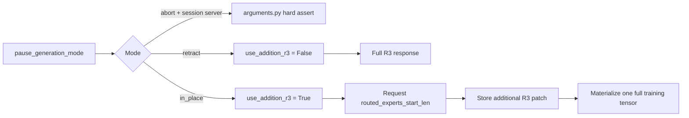

> Status: Implemented. This document records the design and the behavior contract of the landed implementation.

## Motivation and decision

TITO sessions send the full accumulated token sequence on every chat turn. When routing replay is enabled, SGLang currently returns routed-expert replay data (R3) for the full prompt and response again, so a long multi-turn session repeatedly base64-encodes, transfers, stores, and decodes the same prefix rows. The cumulative R3 payload grows approximately with the sum of all turn lengths instead of the final trajectory length.

The decision is to let the session server request only the additional R3 rows when weight updates use `in_place`. A session-server-internal boolean named `use_addition_r3` owns this behavior. It is derived automatically from `args.pause_generation_mode == "in_place"`; it is not a new CLI flag and cannot be configured independently.

The implementation is successful when the final training `Sample.rollout_routed_experts` is byte-for-byte identical to a full-R3 reference produced under the same `in_place` lifecycle while each turn transfers only the suffix that has not already been retained by the session. This equivalence comparison changes only whether SGLang slices the returned R3; it does not compare `in_place` with `retract`, whose weight-update lifecycle can legitimately produce different data. The existing full-R3 behavior remains unchanged in `retract` mode.

## Constraints and non-goals

- `--use-session-server` and `--pause-generation-mode=abort` are incompatible and must fail during argument validation before any session server or rollout engine starts.
- `retract` must preserve the current request, response, record, decode, and merge behavior: SGLang returns complete prompt-plus-response R3 because the KV cache is cleared and the prefix is prefilled again.
- Additional R3 is enabled only by `in_place`, where the active request and its KV-backed prefix remain in place across a weight update.
- `use_addition_r3` is an internal session-server parameter. It is not added to `argparse`, environment variables, HTTP APIs, or persisted user configuration.
- The mode mapping is static and explicit. Session code does not inspect updater implementations, cache metrics, retraction counters, or response metadata to rediscover the configured weight-update mode.
- Downstream sample serialization, training-data conversion, and routing replay keep their existing full-tensor contract: `rollout_routed_experts.shape[0] == len(tokens) - 1`.
- This proposal changes routed-expert replay only. It does not add an incremental protocol for `indexer_topk` or alter non-session `/generate` and chat-completion paths.
- The expected savings are in R3 collection output, base64/JSON serialization, HTTP transfer, session retention, decoding, and repeated full-prefix copying. This proposal does not claim to reduce the model's MoE routing computation.

## Current behavior

The current session path establishes the following facts:

- `SessionCore.chat_completions` in `miles/rollout/session/core.py` replaces messages with full TITO `input_ids` and sets `return_routed_experts=True` whenever routing replay is enabled.
- The unmodified upstream response is retained in `SessionRecord`, including its base64 `choice.meta_info.routed_experts` value.
- `get_routed_experts_from_response` in `miles/rollout/generate_utils/generate_endpoint_utils.py` decodes the explicit row count supplied by its caller; full-R3 callers pass `len(tokens) - 1`.
- `compute_samples_from_openai_records` in `miles/rollout/session/samples/merge.py` builds one `Sample` per record. Full-R3 samples keep the existing later-snapshot merge behavior, while addition-mode patches stay in records until post-merge materialization.
- `examples/infra_features/random_async/random_async_rollout.py` already demonstrates the SGLang wire contract: a response with `routed_experts_start_len=s` contains `total_tokens - 1 - s` rows.

For turn `i`, let `N_i` be the number of prompt and completion tokens represented by the response. The current raw int32 payload contains `(N_i - 1) * num_layers * topk` values. Across many turns, the repeated-prefix cost is proportional to `sum(N_i - 1)`. Strictly contiguous additional R3 makes the transferred row count proportional to the final trajectory length.

## Alternatives and choice

| Alternative | Result | Decision |
|---|---|---|
| Always return full R3 | Keeps the current implementation but retains the repeated-prefix overhead. | Rejected because it does not solve the motivating cost. |
| Add a user-facing `--use-addition-r3` flag | Allows combinations such as `retract` plus additional R3, which are incorrect, and makes users coordinate two descriptions of the same lifecycle. | Rejected. |
| Check `pause_generation_mode` throughout request and assembly code | Produces the right branch but couples R3 data handling directly to weight-update policy in multiple modules. | Rejected. |
| Derive one internal `use_addition_r3` parameter at session-server startup | Makes the legal mode mapping explicit once and lets all session R3 logic depend on one capability. | Chosen. |

## Design

### Configuration and ownership

`miles_validate_args` in `miles/utils/arguments.py` adds the configuration invariant:

```python
assert not (
    args.use_session_server and args.pause_generation_mode == "abort"
), "--use-session-server is incompatible with --pause-generation-mode=abort"
```

The session-server bootstrap derives the internal capability without adding an attribute intended for CLI configuration; `SessionServer.__init__` is the single derivation point, so the mapping cannot be configured independently of the mode:

```python
self.use_addition_r3 = getattr(args, "pause_generation_mode", None) == "in_place"
setup_session_routes(self.app, self, args, use_addition_r3=self.use_addition_r3)
```

`SessionServer` passes the boolean through `setup_session_routes` to both cores: the linear `SessionCore` and the tree-serving `SessionCoreV2`. The cores and the session-specific sample assembler read `use_addition_r3`; they do not read `pause_generation_mode` to choose R3 behavior.

| Session server | Weight-update mode | `use_addition_r3` | R3 behavior |
|---|---|---:|---|
| Disabled | Any mode | Not constructed | No session behavior change. |
| Enabled | `abort` | N/A | Startup assertion fails. |
| Enabled | `retract` | `False` | Omit `routed_experts_start_len` and retain full R3 behavior. |
| Enabled | `in_place` | `True` | Request and assemble additional R3. |

If routing replay itself is disabled, `use_addition_r3=True` is dormant: the request contains neither `return_routed_experts` nor `routed_experts_start_len`.



### Request offset

The offset is computed in phase 1 of `SessionCore.chat_completions`, under the session lock, after `prepare_pretokenized` has applied any retry rollback and returned the new prompt token IDs. No independent monotonically increasing R3 counter is added to session state.

```text
previous_rows = max(0, len(checkpoint_token_ids) - 1)
stable_prefix_tokens = LCP(checkpoint_token_ids, prompt_token_ids)
assert stable_prefix_tokens >= previous_rows
routed_experts_start_len = previous_rows
```

The strict prefix assertion proves that every skipped row belongs to the unchanged causal prefix. A checkpoint containing `N` tokens has exactly `N - 1` reusable R3 rows, so every successful patch starts where the preceding retained patch ended. A first turn or a rollback to the empty checkpoint starts at `0`; retry rollback first removes discarded records, then the new request starts at the retained checkpoint boundary.

The v2 tree server computes the same offset against the positioned attach node's token snapshot (`active_token_ids()` after `position_for_request`). Each root-to-leaf path is assembled independently, so a sibling branch starts at its retained ancestor boundary without overlapping another branch's patch stream.

When `use_addition_r3` and routing replay are both enabled, the session server sends:

```json
{
  "return_routed_experts": true,
  "routed_experts_start_len": 123
}
```

The field is inserted before `proxy_body` is serialized. Because the full upstream request is later stored in `SessionRecord.request`, the exact offset used by a successful turn is persisted with its response without adding another record field. In `retract` mode the field is omitted, preserving the original wire request and SGLang's default full response.

### Response and patch contract

For a stored record, define:

```text
end = len(request.input_ids) + len(output_token_logprobs) - 1
start = request.routed_experts_start_len
delta_rows = end - start
```

The generic R3 decoder accepts `delta_rows` explicitly and infers `topk` from the payload shape as before. If every record lacks R3, routing replay is dormant and the merged tensor remains `None`. Once any R3 payload exists, reshape rejects a wrong value count, concatenation rejects inconsistent top-k, and the session assembler rejects missing required payloads, invalid offsets, incomplete coverage, and any non-contiguous boundary.

The append-only contract is:

```text
assert start_i == end_(i-1)
R_i = R_(i-1) + delta_i
```

Rollback removes discarded records before a replacement request is sent, and v2 assembles each root-to-leaf path independently. The retained record stream therefore never needs overlap replacement; both a gap and an overlapping `start_i` are malformed.

### Session-specific assembly

Additional R3 reconstruction belongs to `miles/rollout/session/samples/merge.py`, because only the session path persists ordered records and their offsets. The generic decoder accepts an explicit row count but does not gain patch ordering or delta semantics, and generic `merge_samples` remains unchanged.

The additional path performs these operations:

1. Build per-turn token, log-probability, loss-mask, status, indexer replay, and lifecycle data using the existing TITO alignment rules while keeping patch-shaped R3 out of per-turn `Sample`s.
2. Apply the existing trailing-token trim and `max_seq_len` selection, then call ordinary `merge_samples` so its existing stop rules determine the final tokens.
3. Set `required_rows = len(merged.tokens) - 1`, decode ordered patches until they cover that prefix, and require every `start_i` to equal the raw row count already covered.
4. Concatenate the decoded chunks once, slice to `required_rows`, and attach the resulting full tensor to the merged `Sample`.
5. Pass the full tensor through the existing safetensors codec, driver decode, training-data conversion, and routing-replay consumers unchanged.

The `retract` branch keeps the existing per-record full decoder and later-snapshot merge behavior. This explicit split makes “retract remains unchanged” testable rather than treating `start_len=0` as an incidental approximation of the old path.

The v2 tree server reuses the same assembler per leaf inside `build_leaf_material`: each root-to-leaf path is exactly the linear record chain its offsets were computed on, so every leaf materializes its own required R3 prefix.

### Session lifecycle and concurrency

- The offset is bound to the phase-1 checkpoint snapshot while the session lock is held.
- Only a phase-3 response whose `expected_num_assistant` still matches may update the TITO checkpoint and append its record. A stale concurrent response therefore cannot introduce an orphan R3 patch.
- Retry rollback truncates token checkpoints and records together. Recomputing the offset from the selected checkpoint keeps the R3 patch stream aligned without another rollback mechanism.
- Session deletion, client response stripping, and fake streaming remain unchanged. Agent-facing chat responses still do not expose replay payloads.

### Compatibility and failure behavior

- The deployment's SGLang revision must support `routed_experts_start_len` on `/v1/chat/completions`. There is no silent fallback from additional to full R3, because silently changing the payload contract can create an undetected gap or duplicate prefix.
- If SGLang rejects an additional-R3 request with a non-200 response, the session server retains the existing proxy behavior and does not record the turn.
- Malformed stored R3 is reported by the existing `/sessions/{id}/samples` assembly error boundary rather than changing the successful agent-facing chat response format.
- In-memory sessions require no migration. Retract sessions continue through the full-R3 branch; an addition-mode record with an R3 payload but no `routed_experts_start_len` is malformed and returns `422` during sample assembly.
- Configured `in_place` is the source of truth for this design. Whether every updater correctly preserves active KV under that mode is a backend correctness requirement, not a capability-discovery responsibility of the session server.

## Implementation and verification

The work can land in four reviewable cuts:

1. Add the `abort` startup assertion and wire the derived `use_addition_r3` boolean through `SessionServer`, `setup_session_routes`, and `SessionCore`.
2. Compute and persist `routed_experts_start_len` for in-place session requests while leaving retract requests byte-for-byte unchanged with respect to R3 fields.
3. Let the generic R3 decoder accept an explicit row count, then add session-specific contiguous patch decoding and one-time full-tensor materialization without changing the `Sample`, codec, or trainer contracts.
4. Add correctness tests and extend the existing session overhead benchmark to compare actual full and additional payloads.

The minimum CPU verification command is:

```bash
pytest -q tests/fast/utils/test_arguments.py tests/fast/router/test_sessions.py tests/fast/rollout/session/test_samples.py tests/fast/router/test_session_samples_op.py
```

Tests must cover:

- `session + abort` fails validation, `session + retract` derives `False`, and `session + in_place` derives `True`.
- Retract requests omit `routed_experts_start_len` and preserve the existing full-R3 expected response and final tensor.
- In-place first turn starts at `0`; later turns use the retained checkpoint row count; retry rollback and v2 branches restart at their retained ancestor boundary.
- Two or more additional patches reconstruct exactly the same final int32 tensor as full-R3 responses for the same tokens and the same `in_place` weight lifecycle.
- Supported TITO trailing-token trim, `max_seq_len` cuts within or before a later turn, and an empty delta preserve the final full-tensor contract.
- Gapped, overlapping, missing, or malformed required patches return `422`; patches beyond the rows selected by ordinary merge are not decoded.
- Routing replay disabled remains unaffected even when `use_addition_r3=True`.

An SGLang integration check must additionally prove that, for each response, decoded rows equal `len(input_ids) + completion_tokens - 1 - routed_experts_start_len`. The performance comparison should report upstream R3 bytes and `/samples` assembly time for identical multi-turn `in_place` trajectories using full-R3 and addition-R3 response forms; correctness passes only if final tokens, loss mask, log probabilities, and full R3 are identical between those response forms.

## Risks and open questions

- Miles currently does not pin the rolling SGLang server source in all build paths. The integration test must run against the deployed revision so a field that is accepted but ignored cannot masquerade as successful additional R3.
- The additional protocol removes repeated payload work, but SGLang may still capture or stage full-prefix routing state internally. Any claim about GPU-side savings requires a separate SGLang measurement.
- The precise performance acceptance threshold is not yet fixed. Correctness and asymptotic payload reduction are blocking; a numerical latency target can be set after the existing manual benchmark measures representative turn lengths, layer counts, and top-k values.
