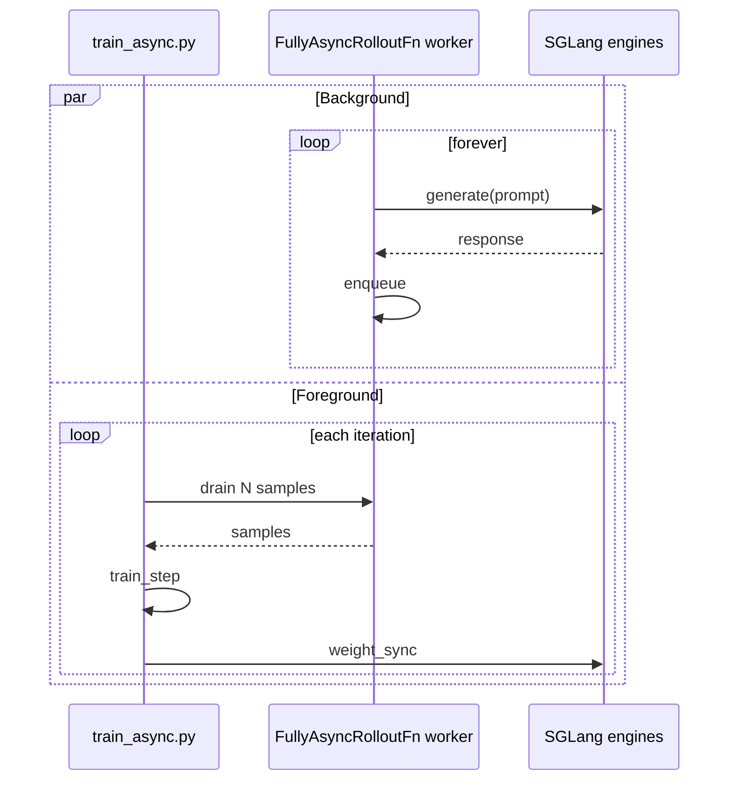

**What you'll learn:** how to make rollout production and trainer consumption fully
parallel, with a queue in between, by using a custom rollout function.

In the default training loop, every iteration looks like:

```text
for it in range(N):
    prompts   = sample()        # cheap
    responses = generate()      # 10-30s
    rewards   = score()         # 1-3s
    loss      = train_step()    # 5-20s
    sync_weights()              # 1-10s
```

`generate()` blocks `train_step()`. With Async Rollout the loop is split: a background
thread runs `generate` continuously, and the trainer drains a queue. The two run in
parallel and the wall-clock time per iteration drops to roughly `max(generate, train)`
instead of the sum.

## Prerequisites

* You completed the [Qwen3-4B](/models/qwen/qwen3) recipe (or have an
  equivalent model + dataset).
* Comfortable with [Customization](/user-guide/customization) — async rollout uses
  a custom rollout function.

## Files

```text
miles/rollout/fully_async_rollout.py # FullyAsyncRolloutFn (worker + drain)
examples/fully_async/
├── run-qwen3-4b-fully_async.sh     # launch script (Qwen3-4B)
└── run_qwen3_30b_a3b_fully_async.py # MoE variant
```

## Quick start

```bash
cd /root/miles
bash examples/fully_async/run-qwen3-4b-fully_async.sh
```

You should see:

```text
Started fully-async rollout worker
First rollout sample: ...
```

## What changes vs. the default recipe

Just two flags:

```diff
- python3 train.py ...
+ python3 train_async.py ...
+   --rollout-function-path miles.rollout.fully_async_rollout.FullyAsyncRolloutFn
```

Everything else — model args, optimizer, GRPO config — stays the same.

## Walkthrough

The interesting code is small. `FullyAsyncRolloutFn` is a class-based rollout
function: the constructor receives the args and data source once, and the worker is a
long-lived task on the shared rollout event loop, started lazily on the first train
call:

```python miles/rollout/fully_async_rollout.py
class FullyAsyncRolloutFn:
    async def __call__(self, input):
        if input.evaluation:
            raise ValueError(...)
        if self._worker is None:
            self._output = asyncio.Queue(maxsize=OUTPUT_QUEUE_MAX_GROUPS)
            self._worker = asyncio.create_task(self._worker_loop())
        return await self._drain(input.rollout_id)
```

Key points:

* **Instance state, no globals.** The worker, queue, and `GenerateState` live on the
  rollout-fn instance that `RolloutManager` holds for the process lifetime.
* **One event loop.** Worker, drain, and eval coroutines all run on the shared rollout
  loop — plain `asyncio.Queue`, no threads, no locks, no `atexit`.
* **Errors are loud.** A failed generation task kills the worker, and the next drain
  raises instead of hanging.

The worker keeps `--rollout-batch-size` groups in flight using
`generate_and_rm_group`:

```python
async def _worker_loop(self):
    active = set()
    while True:
        while len(active) < self._max_in_flight_groups():
            active.add(self._submit_one_group())
        done, active = await asyncio.wait(active, return_when=asyncio.FIRST_COMPLETED)
        for task in done:
            await self._output.put(task.result())
```

And each training step simply drains, recycling aborted or stale groups back into the
data source:

```python
async def _drain(self, rollout_id):
    data = []
    while len(data) < self.args.rollout_batch_size:
        group = await self._next_group()
        if any(s.status == Sample.Status.ABORTED for s in _iter_samples(group)):
            self._recycle(group)
            continue
        data.append(group)
    return RolloutFnTrainOutput(samples=data, metrics=...)
```

## What's happening underneath



The producer loop is decoupled from the consumer loop. As long as the queue stays
populated, the trainer never blocks on generation.

## Tuning knobs

| Knob | Effect |
|---|---|
| `--rollout-batch-size` | Worker target in-flight count |
| `--sglang-server-concurrency` | Per-engine concurrency cap |
| `--num-steps-per-rollout` | Increase to consume more per drain (off-policy) |

If queue depth grows unbounded, training is slower than rollout — bump
`--num-steps-per-rollout` (you'll be slightly off-policy) or scale up trainer
parallelism.

If queue depth stays at 0, rollout is the bottleneck — that's where async helps least
because there's nothing waiting to be consumed.

## What to watch

```text
async/queue_depth                 stable (50-200 typical)
async/producer_throughput_qps     consistent
async/consumer_drain_seconds      < producer cycle time
```

If `consumer_drain_seconds > producer_cycle_time`, your trainer is starving the queue —
check GPU utilization.

## Limitations

* **No evaluation mode.** `FullyAsyncRolloutFn` raises on eval; set
  `--eval-function-path` to the standard
  `miles.rollout.inference_rollout.inference_rollout_common.InferenceRolloutFn`.
* **Requires `MILES_EXPERIMENTAL_ROLLOUT_REFACTOR=1`.** Class-based rollout functions
  only load on the new rollout API.
* **Best-effort ordering.** Samples are sorted by index at drain time, but exact-order
  guarantees aren't provided.

## Variations

### Async on a 30 B MoE

`run_qwen3_30b_a3b_fully_async.py` shows the same pattern with `tp=4 ep=8` and
`--sglang-enable-ep-moe`. The only practical difference is increasing
`--rollout-batch-size` to 64+ to keep the larger engine pool fed.

### Async + R3

Async rollout and R3 stack cleanly. Add:

```bash
GRPO_ARGS+=( --use-rollout-routing-replay )
```

The custom rollout function automatically passes `return_routed_experts=true` because
it uses `generate_and_rm_group` under the hood.

### Async + partial rollout

If you also use `--partial-rollout`, half-finished trajectories are saved to disk and
resumed — useful when the worker is killed mid-flight.
