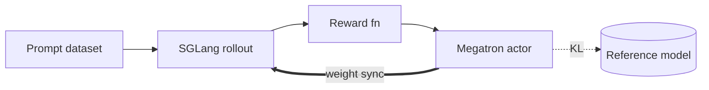

This page takes you from `docker pull` to a running GRPO training job on Qwen3-4B. It
assumes an 8-GPU node (H100 / H200 / B-series) and roughly 200 GB of disk.

A Miles job combines two engines: [SGLang](https://github.com/sgl-project/sglang)
generates responses from the current policy (the *rollout*), and
[Megatron-LM](https://github.com/NVIDIA/Megatron-LM) updates the policy from those
responses (the *training*). In this recipe both share the same 8 GPUs.

For other models, see [Models](/models/index).

## 1. Start the container

On the **host**:

```bash
docker pull radixark/miles:latest
docker run --rm \
  --gpus all --ipc=host --shm-size=32g \
  --ulimit memlock=-1 --ulimit stack=67108864 \
  --network=host \
  -it radixark/miles:latest /bin/bash
```

The flags matter: `--gpus all` exposes the GPUs, `--ipc=host` and `--shm-size=32g`
give NCCL and Ray the shared memory they need, and `--network=host` lets you reach
the Ray dashboard from the host.

That drops you into a shell inside the container. The image ships with Miles at
`/root/miles` and Megatron-LM at `/root/Megatron-LM`. Refresh the editable install
so you run the latest main:

```bash
cd /root/miles && git pull && pip install -e . --no-deps
```

Steps 2–4 below all run inside the container.

## 2. Download model and data

Three artifacts are needed: the model you will train, a training prompt set, and an
evaluation set.

```bash
hf download Qwen/Qwen3-4B --local-dir /root/Qwen3-4B
hf download --repo-type dataset BytedTsinghua-SIA/DAPO-Math-17K --local-dir /root/dapo-math-17k
hf download --repo-type dataset zhuzilin/aime-2024 --local-dir /root/aime-2024
```

Qwen3-4B is the starting policy. DAPO-Math-17K supplies the training prompts — math
problems whose ground-truth labels the reward function checks answers against.
AIME-2024 is a small, harder benchmark used only for periodic evaluation, never for
training.

## 3. Convert to Megatron format

Megatron consumes a `torch_dist` checkpoint, not the raw HuggingFace directory. The
`source` line below loads `MODEL_ARGS`, the Megatron-side description of the
architecture (layer count, hidden sizes, attention layout); the converter uses it to
map the HuggingFace weights into a sharded `torch_dist` checkpoint.

```bash
cd /root/miles
source scripts/models/qwen3-4B.sh

PYTHONPATH=/root/Megatron-LM python tools/convert_hf_to_torch_dist.py \
   ${MODEL_ARGS[@]} \
   --hf-checkpoint /root/Qwen3-4B \
   --save /root/Qwen3-4B_torch_dist
```

Keep the original HuggingFace directory too — the launch script still points the
SGLang engines at it (`--hf-checkpoint`).

For larger models, run the converter under `torchrun --nproc-per-node 8` (optionally
multi-node). See the [Models](/models/index) section for per-family conversion
commands.

## 4. Launch training

```bash
bash scripts/run-qwen3-4B.sh
```

The script is organized into named argument groups (`CKPT_ARGS`, `ROLLOUT_ARGS`,
`GRPO_ARGS`, and so on) and is meant to be read and edited — it is the canonical
place to change hyperparameters. When launched, it starts a local Ray cluster and
submits `train.py` as a Ray job. The run is colocated (`--colocate`): the four
SGLang engines (2 GPUs each) and the Megatron trainer share the same 8 GPUs,
alternating between generation and training phases.

A few defaults worth knowing on a first run:

- Checkpoints are written to `/root/Qwen3-4B_miles/` every 20 rollouts
  (`--save-interval 20`).
- The policy is evaluated on AIME-2024 every 20 rollouts (`--eval-interval 20`).
- If the run dies, relaunch the same script — `--load` points at the save
  directory, so training resumes from the last checkpoint.
- The Ray dashboard at `http://localhost:8265` shows per-worker logs and GPU usage.

After a minute or two you should see iteration logs:

```text
[ray]      starting cluster on 1 node, 8 gpus
[sglang]   launching 4 engines (tp=2 each)
[megatron] loading dist checkpoint from /root/Qwen3-4B_torch_dist
[trainer]  iter 1/3000 | loss=0.412 reward=0.61 rollout=18.4s train=22.1s
```

## 5. What's happening

Each iteration runs the same four steps:



1. Sample `rollout-batch-size` prompts from the dataset and let the SGLang engines
   generate `n-samples-per-prompt` candidate responses for each.
2. Score every response with the reward function — `--rm-type deepscaler` in this
   recipe, a rule-based verifier that compares the model's final answer against the
   dataset label.
3. Compute the GRPO objective from the scored responses and step the optimizer. The
   frozen reference model provides the optional KL regularization term (this recipe
   sets `--kl-loss-coef 0.00`, so the term is off).
4. Push the updated weights back to the SGLang engines. This recipe uses the default NCCL broadcast; you can switch to point-to-point RDMA transfer with `--update-weight-transfer-mode p2p`.

The four batch-sizing knobs satisfy:

```
rollout_batch_size × n_samples_per_prompt
  = global_batch_size × num_steps_per_rollout
```

Miles fills in whichever side you leave unset. In this recipe, 32 prompts × 8
samples = 256 = one optimizer step at global batch size 256.

## Inspecting a run

| Question | Where to look |
|---|---|
| Is the policy learning? | `loss` and `reward` columns in stdout, or wandb |
| Rollout or train bottleneck? | `rollout=` vs. `train=` timings per iteration |
| Are GPUs saturated? | `nvidia-smi dmon -s u` |
| SGLang internals? | `tail -f /tmp/sglang/*.log` |
| Ranks crashing? | `~/.ray/session_latest/logs/worker-*.err` |

## Next steps

- [Core concepts](/user-guide/concepts) — the model behind rollout / actor / reference.
- [Training script walkthrough](/user-guide/training-script-walkthrough) —
  an annotated tour through every argument group in a launch script, plus colocation,
  dynamic sampling, partial rollout, and BF16+FP8 inference.
- [Training backends](/user-guide/usage) — Megatron vs FSDP.
- [Customization](/user-guide/customization) — plug in custom rollout / reward.
- [Models](/models/index) — recipes for Qwen3.5, GLM4.5, DeepSeek V4, Kimi K2, and more.

If you hit issues, the [FAQ](/faq) covers the common ones.
