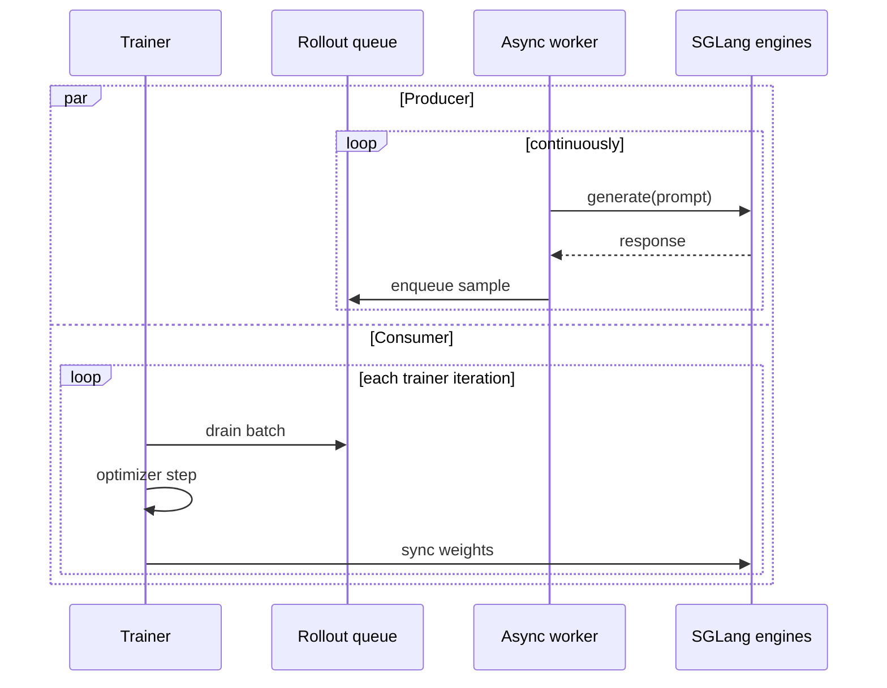

Fully async rollout splits Miles into two concurrent loops:

1. A background rollout worker keeps SGLang generation in flight and pushes completed
   samples into a queue.
2. The trainer drains the queue, runs optimizer steps, and syncs updated weights back
   to rollout engines.

When rollout and training take similar time, per-iteration wall time moves from
`rollout_time + train_time` toward `max(rollout_time, train_time)`.

## When to use it

| Use fully async when | Stay synchronous when |
|---|---|
| Rollout is a large part of wall time | Debugging a new recipe |
| The run is long enough to amortize queue warm-up | You need the strictest possible on-policy cadence |
| SGLang engines can keep many requests in flight | Queue depth stays at zero even after tuning concurrency |
| You can tolerate slightly older samples in exchange for throughput | You are validating loss math or reward plumbing |

The mode is especially useful for long-context math, tool-use, and agentic workloads
where generation dominates the iteration.

## Enable it

Switch the entrypoint from `train.py` to `train_async.py`, enable the class-based
rollout API, and select the rollout function that owns the background worker:

```diff
- python3 train.py ...
+ MILES_EXPERIMENTAL_ROLLOUT_REFACTOR=1 python3 train_async.py ...
+   --rollout-function-path miles.rollout.fully_async_rollout.FullyAsyncRolloutFn
```

Everything else belongs in the same [argument groups](/user-guide/argument-groups) as a
synchronous run.

## Queue model



The queue is the contract. If it stays populated, the trainer does not wait for
generation. If it is empty, rollout is still the bottleneck and async cannot hide it.

## Tuning knobs

| Knob | What it changes |
|---|---|
| `--rollout-batch-size` | Target amount of work the async producer keeps in flight |
| `--sglang-server-concurrency` | Per-engine request concurrency |
| `--global-batch-size` | Number of samples the trainer drains per step |
| `--num-steps-per-rollout` | Number of optimizer steps per queue drain cycle |
| `--max-weight-staleness` | When the rollout engine's weight version lags the trainer's by more than this, the worker recycles the stale group instead of feeding it to the loss |

The worker caps its output queue at 1000 groups, so if training is slower than
rollout the producer eventually blocks rather than growing the queue without
bound. If the queue stays at zero, rollout is the bottleneck — scale rollout capacity
or lower per-sample generation cost.

## What to monitor

The worker reports per-step metrics to wandb/dashboard alongside the standard rollout
metrics:

```text
rollout/fully_async/queue_size
rollout/fully_async/aborted_groups_recycled
rollout/fully_async/stale_groups_recycled
rollout/fully_async/avg_staleness, rollout/fully_async/max_staleness
```

A `No completed rollout groups for <N>s` warning in the logs means the drain is
starved — rollout is the bottleneck.

Treat large staleness windows as a training-quality signal, not just a performance
signal. Fast [P2P weight transfer](/advanced/p2p-weight-transfer) keeps the
rollout engines closer to the latest actor weights so fewer groups get recycled by
`--max-weight-staleness`.

## Evaluation

Without extra GPUs (`--eval-num-gpus` unset), eval **shares the rollout engines**:
the producer pauses new submissions for the duration of the blocking eval and resumes
after. The weight version stays pinned because no update interleaves while the driver
awaits eval — expect `mixed_version_ratio == 0` with the training fleet's update
counter as the version label (a constant offset from `eval/step`, unlike the dedicated
fleet which stamps the rollout_id). The cost is that rollout production stalls for
roughly the eval duration, which is fine for small debug eval sets.

For eval that never touches training capacity, use a **dedicated eval fleet** synced
through HF checkpoint snapshots — never by joining training weight updates:

```bash
--eval-num-gpus 1                        # dedicated eval engines (own router)
--eval-interval K
--eval-hf-dir /dev/shm/miles_eval_hf     # snapshot staging; tmpfs = no disk dependency
--eval-prompt-data aime /path/to/aime.jsonl
```

Per eval-due step the trainer exports an HF snapshot (seconds to tmpfs), fires the
eval **fire-and-forget**, and keeps training; the eval fleet pins its weights to the
snapshot (`weight_version = str(rollout_id)`), runs the standard eval datasets, and the
point lands at the right x-axis step even when it completes a few steps later
(`eval/lag_steps` reports how late).

Two production-oriented variants:

- **Reuse mode**: with `--save-hf` set and `--eval-hf-dir` unset, eval reuses the
  periodic HF checkpoints (requires `eval_interval % save_interval == 0`) — zero extra
  export cost. Pair with `--eval-overflow-policy skip` so a slow eval set can never
  stall training.
- **External service**: `tools/checkpoint_eval_service.py` watches `--save-hf` output
  with its own sglang server — no GPU carve-out from the training job, restartable,
  backfills missed points from its ledger. Works for `--colocate` runs too.

Every skipped point is attributable from the dashboard: `eval/skipped_busy`,
`eval/skipped_ckpt_missing`, `eval/skipped_unhealthy`, `eval/skipped_export_failed`
are logged at the affected step. `eval/{ds}/weight_version/mean == eval/step` and
`mixed_version_ratio == 0` confirm every point measured exactly the intended weights.

The eval-engine `weight_version` namespace is the snapshot's `rollout_id` — deliberately
different from the training fleet's job-local update counter; the two fleets never mix.

## Example implementation

For a complete Qwen3 launch script and worker implementation, see the
[Fully Async Rollout example](/examples/fully-async).
