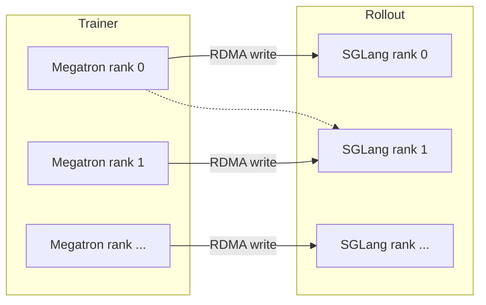

# P2P Weight Transfer

After every training step, the trainer's freshly-updated weights have to make their way
to the SGLang engines so the next rollout uses the on-policy model. At GLM4.5 / DeepSeek
scale that's hundreds of GB of state. The default broadcast path works, but it wastes
bandwidth — every rollout rank receives redundant copies. **P2P transfer** delivers each
shard directly to the rank that needs it.

## Enable it

```bash
--update-weight-transfer-mode p2p
```

That's the entire user-facing API. Reference design discussion: [issue #755](https://github.com/radixark/miles/issues/755).

## What changes

| | Broadcast (default) | P2P |
|---|---|---|
| Per-rank receives | All weights, then drops what it doesn't need | Only its shards |
| Bandwidth | NIC-bound × ranks | NIC-bound × shards |
| Implementation | NCCL collective | RDMA write |
| Latency at GLM4.5 scale | ~25–40 s | ~3–8 s |

## How it works



In detail:

1. **Initialisation** — At startup, each trainer rank:
    * Builds a transfer plan that maps trainer ranks to rollout ranks based on TP/EP/PP
      and GPU counts.
    * Queries each rollout engine for its memory registration info (RDMA addresses +
      sizes).
    * Constructs a local CPU model replica that mirrors the target's sharding so weights
      can be reshaped before transfer.
2. **Weight gather** — Megatron TP/EP shards are all-gathered and converted to HF format
   (same as the broadcast path).
3. **P2P write** — Each trainer rank writes its bucketed tensors directly into the
   destination rollout rank's memory using RDMA. No collective; pure write.
4. **Sync** — When all writes ACK, rollout engines bump their weight version and resume
   generation.

## Hardware requirements

| Item | Required for P2P? |
|---|---|
| NVLink intra-node | Yes |
| InfiniBand or RoCEv2 inter-node | Yes (this is what RDMA writes ride) |
| NCCL with `NCCL_P2P_LEVEL=NVL` | Recommended |
| `NVSHMEM` | Optional, helps |

If you're on a vanilla TCP backplane, P2P falls back to broadcast — nothing breaks but
you lose the speedup.

## Tunable knobs

```bash
--p2p-transfer-num-workers 4           # thread-pool workers for P2P writes (default 4)
--p2p-transfer-timeout 30              # per-transfer timeout in seconds (default 30)
--update-weight-buffer-size 536870912  # bytes per update-weight buffer (default 512 MiB)
--update-weights-interval 1            # rollouts between weight syncs (default 1)
```

## What you should see

If P2P fails to initialise, Miles silently falls back to broadcast — usually a missing
IB device. Re-run with `NCCL_DEBUG=INFO` for the per-rank diagnostics.

## When NOT to use P2P

* Single-node jobs — NVLink intra-node already maxes out broadcast.
* Models < 30 B — overhead isn't worth it.
* You don't have RDMA-capable interconnect.

## Pairs nicely with

* [Fault tolerance](fault-tolerance.md) — P2P retries gracefully fall back to broadcast.
* [INT4 QAT](int4-qat.md) — 4× smaller weights, 4× faster sync.
