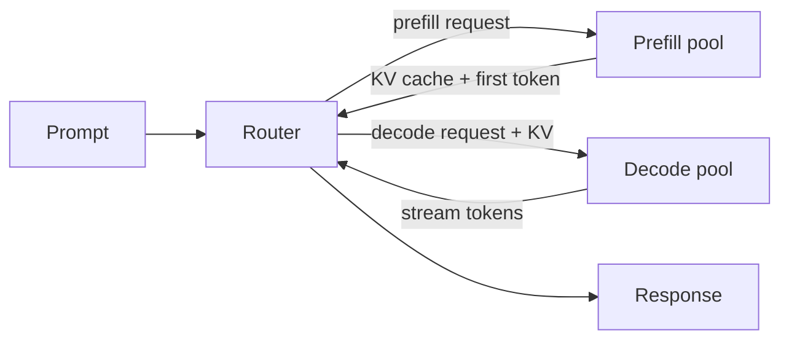

# PD Disaggregation

In a typical SGLang deployment, every engine handles both **prefill** (the one-shot
forward over the prompt) and **decode** (the per-token autoregressive loop). The two have
very different compute profiles:

| Phase | Compute pattern | Bottleneck |
|---|---|---|
| Prefill | Long sequence × full batch | FLOPs |
| Decode | One token × batch | Memory bandwidth |

Mixing them in one engine means you size for the worse case of both. **PD disaggregation**
splits them into two pools, each sized for its own workload.

## Enable it

```bash
SGLANG_ARGS+=(
   --prefill-num-servers 2
)
```

That tells Miles to dedicate 2 of your SGLang servers to prefill and use the rest for
decode. The router knows to route each request appropriately.

## When PD pays off

* Long prompts (≥ 4 K) — prefill dominates total latency.
* High batch sizes during decode — decode is memory-bandwidth bound.
* MoE models — decode benefits disproportionately from EP scaling that prefill doesn't
  need.

For typical post-training with 1–2 K prompts, the overhead of routing + cache transfer
often outweighs the speedup. **Measure first.**

## How requests flow



The KV cache produced by the prefill pool is migrated to the decode pool. SGLang handles
the cache transfer transparently when [Miles Router](miles-router.md) is in use; for
older deployments use the [SGLang Model Gateway](https://docs.sglang.io/advanced_features/sgl_model_gateway.html)
which has first-class PD support.

## Sizing the pools

Rule of thumb:

```
prefill_servers = ceil(rollout_qps × avg_prompt_tokens / single_engine_prefill_tps)
decode_servers  = N - prefill_servers
```

If you don't know your numbers, start with `prefill_num_servers = N / 4` and adjust
based on:

| Symptom | Action |
|---|---|
| Prefill queue backing up | Increase `prefill_num_servers` |
| Decode latency creeping up | Decrease `prefill_num_servers` |
| Router queue depth growing | More servers in *both* pools, then revisit ratio |

## What to measure

```text
sglang/prefill_queue_depth
sglang/decode_queue_depth
sglang/prefill_tps
sglang/decode_tps
sglang/kv_transfer_latency_ms
```

If `kv_transfer_latency_ms` is more than ~5% of total request latency, your interconnect
between prefill and decode pools is the bottleneck — colocate them on the same node or
use RDMA.

## Pairs nicely with

* [DeepSeek R1 recipe](../models/deepseek/deepseek.md) — at 671 B scale, PD is a clear
  win.
* [Speculative decoding](speculative-decoding.md) — drafts run on the decode pool, the
  target verifies on the prefill pool.

## When NOT to use PD

* Small prompts (< 1 K) — prefill is already cheap.
* Single-node setups — pool boundaries don't help.
* Highly variable workloads — fixed pool sizes are wasteful.
