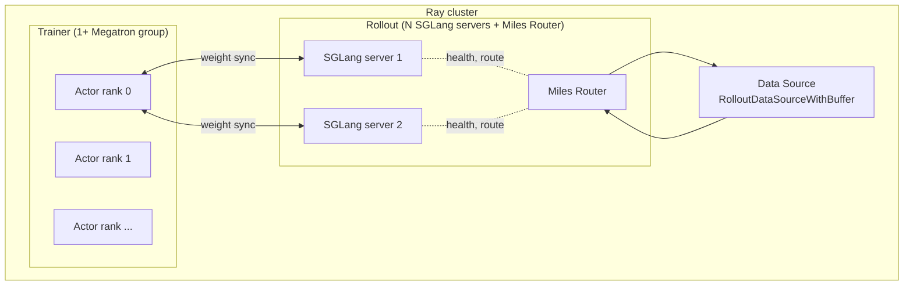
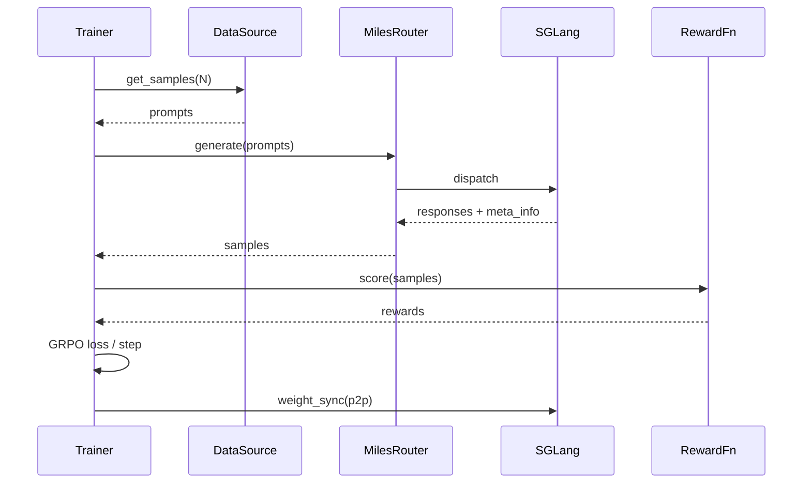

# Architecture Overview

A reading guide before you start patching.

## The processes

A Miles run is three kinds of processes wrapped in a Ray cluster:



* **Trainer ranks** — Megatron processes that load `torch_dist` checkpoints and run the
  RL loop.
* **SGLang servers** — independent HTTP services that produce rollouts.
* **Miles Router** — FastAPI proxy that distributes rollout requests, preserves
  metadata (R3), and enforces health checks.
* **Data Source** — Python object owned by the trainer; reads prompt JSONL and acts as
  a buffer between rollout and training.

## The package layout

```text
miles/
├── algorithms/           # GRPO, PPO, GSPO, REINFORCE++, custom-loss plumbing
├── backends/
│   ├── megatron_utils/   # fp32 markers, optimizer offload helpers
│   └── fsdp/             # FSDP-flavoured trainer (in progress)
├── rollout/
│   ├── sglang_rollout.py # default rollout function
│   ├── data_source.py    # buffer + JSONL loader
│   ├── filter_hub/       # built-in filters
│   └── inference_rollout/# experimental refactor
├── router/               # FastAPI proxy + middleware engine
├── utils/                # async, types, IO, distributed helpers
└── args.py               # CLI argument definitions
```

`train.py` and `train_async.py` are the two entry points. They're thin: ~200 lines
each. Most logic lives in the modules above.

## A request's life

For a single GRPO iteration:



This is the sync path. Async (`train_async.py` + `--rollout-function-path
fully_async_rollout.generate_rollout_fully_async`) breaks the request from the trainer
loop and uses a continuously-running worker.

## Where common changes go

| You want to … | Edit |
|---|---|
| Add a new RL algorithm | `miles/algorithms/<name>.py` + `args.py` enum |
| Add a new built-in reward type | `miles/rollout/sglang_rollout.py` (rm dispatch) |
| Add a new built-in filter | `miles/rollout/filter_hub/` |
| Wrap a new model architecture | `miles_plugins/models/<model>.py` + `mbridge` |
| Add a new flag | `miles/args.py` |
| Change weight sync | `miles/router/` and `miles/utils/distributed.py` |
| Change rollout buffer | `miles/rollout/data_source.py` |

## Extension points (the right way)

The trainer is plug-in-friendly. Most extensions don't need a code change inside Miles —
just pass a `--something-path my_pkg.thing`. See [Customization](../user-guide/customization.md)
for the full list.

If you find yourself patching the trainer to make something work, that's a sign we're
missing a hook. Open an issue.

## Tests

```text
tests/
├── unit/             # fast, no GPU
├── integration/      # spins up Ray + 1 SGLang
└── slow/             # 8-GPU, gated behind RUN_SLOW=1
```

Run `pytest tests/unit` for a quick check; `RUN_SLOW=1 pytest tests/slow` before
landing anything that touches the train loop.

## Where to look first when reading the code

If you have 30 minutes and want to understand Miles end-to-end:

1. `train.py` — the loop, top-to-bottom.
2. `miles/rollout/sglang_rollout.py:generate_rollout` — how prompts become samples.
3. `miles/algorithms/grpo.py` — the loss and advantage computation.
4. `miles/router/app.py` — the FastAPI proxy.
5. `miles/utils/distributed.py` — weight sync.

That's the spine. Everything else hangs off it.
