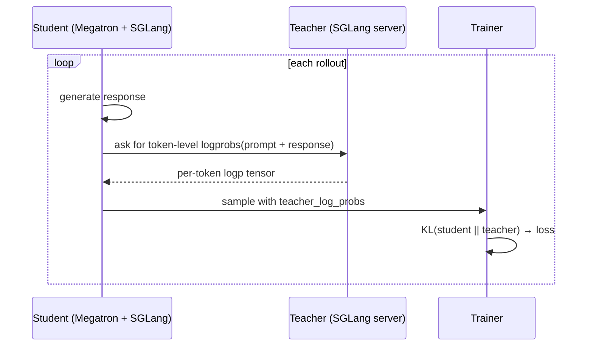

# On-Policy Distillation

**What you'll learn:** how to use a teacher model as a "reward model" that produces
token-level supervision, training a smaller student to imitate it on the student's *own*
rollouts (the on-policy part).

This is one of the cleanest RL recipes in the library because it doesn't need a
real reward function — the teacher is the reward.

## The headline result

| | Math500 Pass@1 |
|---|---|
| Qwen3-8B-Base + SFT | 76% |
| Qwen3-8B-Base + SFT + **On-Policy Distillation** | **94%** |

Same student, no extra labelled data — just a Qwen3-32B teacher giving token-level
guidance during RL.

## Prerequisites

* Two model checkpoints: a strong teacher (Qwen3-32B) and a weaker student (Qwen3-8B).
* You're comfortable with [Customization](../user-guide/customization.md) — this uses
  custom reward and post-process functions.

## Files

```text
examples/on_policy_distillation/
├── on_policy_distillation.py      # reward_func + post_process_rewards
└── run-qwen3-8B-opd.sh            # launches teacher SGLang + Ray training job
```

## Quick start

### 1. Download

```bash
hf download Qwen/Qwen3-32B --local-dir /root/Qwen3-32B
hf download Qwen/Qwen3-8B  --local-dir /root/Qwen3-8B
hf download --repo-type dataset BytedTsinghua-SIA/DAPO-Math-17K \
    --local-dir /root/dapo-math-17k
```

### 2. Convert the student

```bash
cd /root/miles
source scripts/models/qwen3-8B.sh
PYTHONPATH=/root/Megatron-LM python tools/convert_hf_to_torch_dist.py \
   ${MODEL_ARGS[@]} \
   --hf-checkpoint /root/Qwen3-8B \
   --save           /root/Qwen3-8B_torch_dist
```

The teacher does **not** need a Megatron checkpoint — it lives in SGLang only.

### 3. Run

```bash
bash examples/on_policy_distillation/run-qwen3-8B-opd.sh
```

The launch script first starts an SGLang server hosting the teacher, then submits the
Ray job that runs `train.py` with the student.

## How it works



The teacher is wired in as a custom reward (`--custom-rm-path` +
`--custom-reward-post-process-path` + `--rm-url http://teacher:8001`). For each sample
the trainer queries the teacher for token-level log-probabilities of the student's own
response.

The "reward" then becomes a per-token KL divergence between the student's logp and
the teacher's logp. Tokens where the student is over-confident relative to the teacher
get a negative reward; tokens where the student matches get zero.

## Walkthrough — the reward

```python title="on_policy_distillation.py"
async def reward_func(args, sample, **kwargs):
    payload = {
        "input_ids": sample.tokens,
        "sampling_params": {
            "temperature": 0,
            "max_new_tokens": 0,
            "skip_special_tokens": False,
        },
        "return_logprob": True,
        "logprob_start_len": 0,
    }
    async with aiohttp.ClientSession() as session:
        async with session.post(args.rm_url, json=payload) as resp:
            resp.raise_for_status()
            return await resp.json()
```

The "reward" is the entire SGLang `/generate` response — Miles stores it so the
post-processor can read it back via `sample.get_reward_value(args)` and pull the
teacher logprobs out of `meta_info["input_token_logprobs"]`.

## Walkthrough — post-process

```python
def post_process_rewards(args, samples, **kwargs):
    rewards = [sample.get_reward_value(args) for sample in samples]
    response_lengths = [sample.response_length for sample in samples]

    teacher_log_probs = [
        torch.tensor(
            [item[0] for item in r["meta_info"]["input_token_logprobs"][1:]],
            dtype=torch.float32,
        )
        for r in rewards
    ]
    # Keep only the response span (tail of the prompt + response sequence).
    teacher_log_probs = [
        t[-response_length:]
        for t, response_length in zip(teacher_log_probs, response_lengths)
    ]

    for sample, t_log_probs in zip(samples, teacher_log_probs):
        sample.teacher_log_probs = t_log_probs

    return teacher_log_probs, teacher_log_probs
```

This runs *after* rollout but before the trainer's logprob pass, so by the time
Megatron computes the student's own logprobs it can read `sample.teacher_log_probs`
and form the per-token KL used as the GRPO advantage signal.

## Tuning knobs

| Knob | Effect |
|---|---|
| `--rollout-temperature` | High temp = student explores more = teacher signal more useful |
| `--n-samples-per-prompt` | More trajectories = better baselines for advantages |
| `--lr` | Smaller than vanilla RL — distillation can be aggressive |
| Teacher's `tp_size` | Bigger = faster teacher inference = faster rollouts |

## What to watch

```text
opd/avg_kl_to_teacher          decreasing
opd/student_acceptance         > 0.85 of teacher's argmax tokens
opd/teacher_qps                steady (don't over-saturate)
reward/avg                     increasing (less negative over time)
```

If `opd/teacher_qps` saturates, your teacher is the bottleneck — scale it (more SGLang
replicas) or compress the prompts.

## FAQ

**Why is the teacher behind SGLang and not in the trainer?** Because hosting the teacher
inside Megatron/FSDP would require a second, fully configured training stack just to
get logits. SGLang is already designed for high-throughput logit serving — use it.

**Can I distill with a teacher of a different architecture?** Yes — the teacher just
needs to share a tokenizer with the student.

**Can I combine OPD with regular RL?** Yes. Mix `teacher_log_probs` based KL into your
loss alongside a real reward:

```python
total_reward = α * (-kl_to_teacher) + (1 - α) * env_reward
```

Start with α = 0.7 and anneal toward env_reward over training.

## References

* [Thinking Machines blog](https://thinkingmachines.ai/blog/on-policy-distillation/) —
  the post that popularised this recipe.
* [arXiv 2306.13649](https://arxiv.org/abs/2306.13649) — DistillSpec.
* [arXiv 2306.08543](https://arxiv.org/abs/2306.08543) — On-policy distillation.
