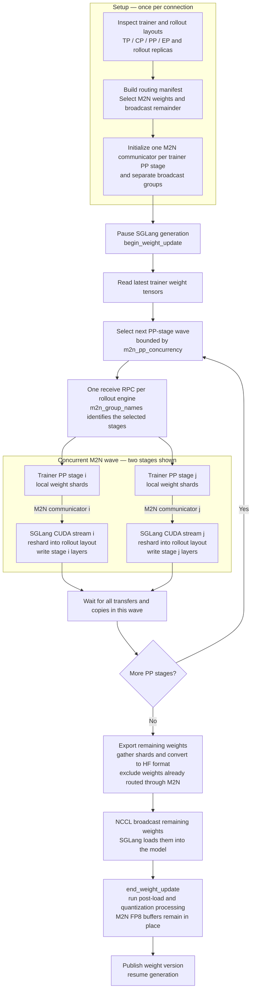

# Small NCCL M2N example

Qwen3-0.6B in BF16 on **four allocated GPUs on one node**, including GB300:
two trainer GPUs (TP1/PP2) and two separate rollout GPUs (one TP2 engine).
This exercises PP ownership, concurrent refits, dense resharding, residual
broadcasts, and generation with CUDA graphs enabled. It does not cover MoE,
FP8/UE8M0, or cross-node transport; the synthetic critical tests retain those
layout regressions. This is a smoke workload, not a model-quality benchmark.

## Weight refit flow

The implementation sends M2N-routed weights first, then broadcasts the remaining
weights. PP stages within an M2N transfer wave can overlap.



For Qwen3-0.6B, the M2N path carries dense MLP gate/up/down weights; attention,
embeddings, output head, and normalization weights use broadcast. Supported FP8
expert transfers additionally carry quantized weights and their scales.

## Prepare

Use compatible Miles and SGLang versions with M2N support installed in the same
environment.

```bash
export MEGATRON_PATH=/root/Megatron-LM
export HF_CHECKPOINT=/root/models/Qwen3-0.6B
export TRAIN_CHECKPOINT=/root/models/Qwen3-0.6B_torch_dist
export DATA_DIR=/root/datasets
export PYTHONPATH="$PWD:$MEGATRON_PATH${PYTHONPATH:+:$PYTHONPATH}"

hf download Qwen/Qwen3-0.6B --local-dir "$HF_CHECKPOINT"
hf download --repo-type dataset zhuzilin/dapo-math-17k \
  --local-dir "$DATA_DIR/dapo-math-17k"
MODEL_ARGS_TEXT="$(python3 miles/utils/external_utils/model_args_utils.py qwen3-0.6B)"
read -r -a MODEL_ARGS <<< "$MODEL_ARGS_TEXT"
torchrun --standalone --nproc-per-node 2 tools/convert_hf_to_torch_dist.py \
  "${MODEL_ARGS[@]}" --hf-checkpoint "$HF_CHECKPOINT" \
  --save "$TRAIN_CHECKPOINT" --pipeline-model-parallel-size 2
```

Skip checkpoint download/conversion or dataset download when the corresponding
files already exist. Use a fresh output directory for conversion. Do not run
conversion alongside training on these GPUs.

## Run

Start a Ray head in the same allocated container, or use an existing compatible
head with four free GPUs. The launcher does not start, stop, or kill Ray processes.

```bash
ray start --head --num-gpus 4 --disable-usage-stats --dashboard-host 127.0.0.1
bash examples/nccl_m2n/run-qwen3-0.6b.sh
```

It uses `zhuzilin/dapo-math-17k`, checks initial weights against the HF-loaded
rollout model (`--check-weight-update-equal`), and performs two rollout/train/refit
iterations. Check for successful equality checks, both PP groups transferring,
and `train/train_rollout_logprob_abs_diff` staying near the broadcast baseline;
the weight check alone cannot detect stale CUDA-graph pointers on later refits.

Set `M2N_PP_CONCURRENCY=1` for stage-ordered refits (default: 2). `DATA_DIR`
defaults to `/root/datasets`; the launcher reads
`$DATA_DIR/dapo-math-17k/dapo-math-17k.jsonl`. Set `PROMPT_DATA` to override that
path with another JSONL containing `prompt` and `label` fields, or
`RAY_DASHBOARD_ADDRESS` to another dashboard endpoint. Extra training arguments
are appended last, e.g.:

```bash
M2N_PP_CONCURRENCY=1 bash examples/nccl_m2n/run-qwen3-0.6b.sh
bash examples/nccl_m2n/run-qwen3-0.6b.sh --update-weight-transfer-mode broadcast
```

## Existing DeepSeek V4 launcher

`scripts/run_deepseek_v4.py` now exposes both options directly. Broadcast remains
the default; M2N requires disaggregated rollout. For an already prepared Flash
checkpoint on sixteen four-GPU GB300 nodes (eight trainer, eight rollout nodes):

```bash
python scripts/run_deepseek_v4.py train \
  --model-name DeepSeek-V4-Flash-FP8 --hardware GB300 \
  --num-nodes 16 --num-gpus-per-node 4 --rollout-num-nodes 8 \
  --update-weight-transfer-mode nccl-m2n --m2n-pp-concurrency 2
```

Existing model/data path options and `--extra-args` still apply. The concurrency
option controls trainer PP transfer waves, not rollout pipeline parallelism.

## M2N unit tests

Run the M2N unit tests from Miles and SGLang.

```bash
# From Miles:
pytest -q tests/fast/backends/megatron_utils/test_nccl_m2n_manifest.py \
  tests/fast/utils/test_arguments.py -k nccl_m2n
# The sender filename matches -k nccl_m2n; all its critical cases are selected.

# From the matching SGLang checkout:
pytest -q test/registered/rl/test_nccl_m2n_receiver.py \
  test/registered/rl/test_distributed_weight_update_spec_worker.py
```
