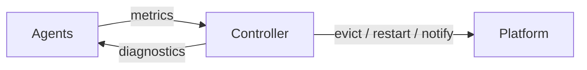

# Fault Tolerance (`miles.utils.ft`)

Fault tolerance for Megatron distributed training on Ray + K8s.
Detects faulty nodes, evicts them via K8s node labels, and auto-restarts
training from the latest checkpoint.

## Architecture



Two layers inside this module:

- **Platform layer** (`platform/`): K8s node-label adapter, Ray job adapter
  (stop/submit), and notification webhooks (Slack, Lark, Discord).
- **Core layer** (`controller/`, `agents/`): The controller runs a periodic tick
  loop with a detector chain, a multi-phase recovery orchestrator, and embedded
  metric stores (MiniPrometheus + MiniWandb). Agents run on every node (hardware
  collectors, Prometheus exporters) and inside every training rank (heartbeat
  exporter, per-step metric push).

The core layer depends only on typed protocols (`protocols/`), not on concrete
K8s/Ray/Prometheus implementations.

## Directory Layout

```
ft/
  agents/            Per-node and per-rank metric collectors + Prometheus exporters
    collectors/      GPU (pynvml), network (sysfs), disk, kernel log (kmsg/dmesg)
    core/            FtNodeAgent, FtTrainingRankAgent, FtTrackingAgent
    utils/           Collection loop, Prometheus exporter, controller handle
  controller/        Central control plane
    detectors/       Fault detector chain (hang, NaN loss, MFU decline, HW, network, crash)
    diagnostics/     On-demand diagnostics (GPU health check, NCCL tests, stack traces)
    metrics/         MiniPrometheus (scrape + storage) and MiniWandb (step-indexed KV)
    recovery_orchestrator/  Multi-phase recovery state machine
  models/            Pydantic data models (faults, metrics, recovery states, diagnostics)
  platform/          K8s node manager, Ray training job, notification webhooks
  protocols/         Typed interfaces (MetricStore, NodeManager, TrainingJob)
  fault_injectors/   Test-only utilities for injecting faults in E2E tests
```

## Data Flow

Three independent monitoring channels feed the controller:

1. **Hardware metrics (pull)** -- Collectors on each node produce `MetricSample`s,
   exposed via a Prometheus HTTP exporter on `FtNodeAgent`. MiniPrometheus periodically
   scrapes these exporters; the controller queries the store for anomalies.

2. **Training heartbeat (pull)** -- Each `FtTrainingRankAgent` (one per Megatron rank)
   exposes iteration counter and training phase as Prometheus gauges, scraped by
   MiniPrometheus. The controller detects stalls by checking iteration progress.

3. **Per-step training metrics (push)** -- Each training rank calls `log_step()` to
   push loss, grad norm, MFU, and iteration time to MiniWandb inside the controller.
   The controller queries recent steps to detect NaN loss or MFU decline.

## Fault Handling

The detector chain runs every controller tick. When a fault is detected:

- **High-confidence hardware fault** (critical XID, majority NIC down): immediately
  evict the bad node (K8s label) and restart training.
- **Other faults** (crash, hang, NaN loss, MFU decline): enter the recovery
  orchestrator, which first reattempts training, then runs on-demand diagnostics
  (GPU health, NCCL bandwidth, stack traces) to identify the culprit node before
  evicting.

## Tests

Tests live in `tests/fast/utils/ft/` and mirror the source directory structure.
Run with `pytest tests/fast/utils/ft/`.
